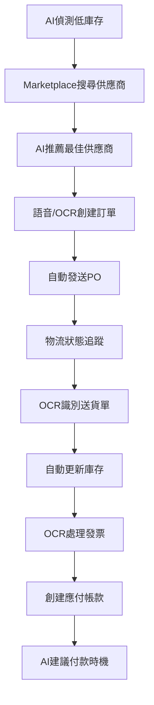
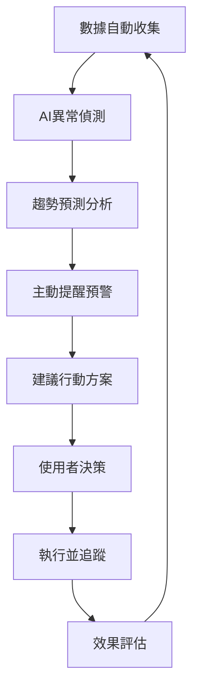
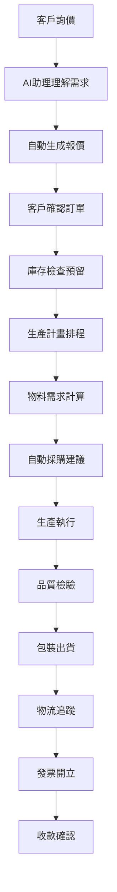

# NexusERP 專案完整解說

**版本:** 1.0  
**最後更新:** 2025-07-13  
**文件類型:** 專案概覽與功能說明

---

## 🎯 專案概覽

**NexusERP** 是一個基於人工智慧的企業資源規劃(ERP)系統，專為中小企業與跨行業經營者設計。系統整合核心業務流程、自動化任務，並提供智慧洞察，以提升營運效率和決策品質。

### 核心特色
- 🤖 **AI驅動**：智慧預測、自動化決策、自然語言互動
- 🏪 **Marketplace**：供應商推薦、智慧採購、網絡效應
- 🏢 **跨行業支援**：支援15個行業，模組化設計
- 📱 **現代化UI**：響應式設計、語音控制、直觀操作
- 🔧 **模組化架構**：可彈性擴展、微服務預備

---

## 🏢 目標用戶與解決方案

### 主要用戶
- **中小型企業(SMBs)**：特別是跨行業經營者（如同時經營農場和零售店）
- **Marketplace參與者**：供應商、買家、平台用戶

### 解決痛點
- ❌ 傳統ERP昂貴複雜、缺乏彈性
- ❌ 跨行業數據分散，難以整合分析
- ❌ 重複性人工作業耗時
- ❌ 缺乏數據洞察力和預測能力
- ❌ 尋找可靠供應商困難

### NexusERP解決方案
- ✅ **模組化與彈性**：可根據行業需求配置擴展
- ✅ **AI驅動自動化**：OCR、預測、推薦、AI助手
- ✅ **跨行業整合**：統一平台管理多業務單位
- ✅ **Marketplace生態**：供應商推薦、交易平台
- ✅ **現代化介面**：語音輸入、直觀操作

---

## 🛠️ 技術架構

### 核心技術堆疊
```
前端層：PHP/Laravel + Blade模板 + Vite + JavaScript
API層：Golang/Gin框架 + RESTful API
資料層：PostgreSQL（主要）+ Redis（快取、Session）
儲存層：MinIO (S3相容)
容器化：Docker + Docker Compose
AI整合：外部OCR服務、RAG/CAG模型、LLM API
```

### 架構特色
- **前後端分離**：清晰的職責分工
- **模組化設計**：可彈性擴展
- **多租戶支援**：透過`business_unit_id`實現數據隔離
- **微服務預備**：Marketplace模組可獨立部署
- **容器化部署**：Docker環境一致性

### 數據管理模式
- **主要資料庫**：PostgreSQL存儲結構化業務數據
- **數據隔離**：應用層`business_unit_id`過濾
- **非結構化數據**：JSONB欄位存儲彈性數據
- **檔案儲存**：MinIO存儲上傳文件
- **快取機制**：Redis緩存常用數據

---

## 📋 核心功能模組

### 1. 標準ERP功能

#### 庫存管理
- 📦 **產品主數據**：SKU、分類、計量單位
- 🏪 **倉庫管理**：多倉庫、儲位管理
- 📊 **庫存追蹤**：即時庫存、安全庫存預警
- 🔄 **庫存調整**：盤點、調整、轉移
- 📈 **庫存交易**：完整交易記錄追蹤

#### 採購管理
- 🤝 **供應商管理**：供應商資料、付款條件
- 📋 **採購訂單**：PO創建、追蹤、狀態管理
- 📥 **收貨流程**：收貨記錄、品質檢驗
- 💰 **發票處理**：供應商發票、付款記錄

#### 銷售管理
- 💼 **客戶管理**：客戶資料、聯絡人管理
- 📊 **報價管理**：報價單創建、版本控制
- 📋 **訂單管理**：銷售訂單、出貨追蹤
- 💳 **發票開立**：自動發票、收款記錄

#### 財務管理
- 📚 **會計科目**：科目表管理、分類設定
- 💰 **應收帳款**：客戶發票、收款追蹤
- 📄 **應付帳款**：供應商發票、付款管理
- 📊 **總帳管理**：分錄記錄、財務報表

#### 製造營運
- 🔧 **BOM管理**：物料清單、版本控制
- 🏭 **生產訂單**：排程、追蹤、回報
- ⚙️ **工作中心**：產能管理、效率追蹤
- 📈 **生產回報**：完工記錄、庫存更新

### 2. AI智慧功能

#### AI助理（智能夥伴）
- 🎯 **自然語言查詢**：
  - "幫我找出上個月智能感應器X1在華東區的總銷售額"
  - "目前精密軸承Y2在中心倉庫的庫存量是多少？"
  - "列出所有待審核且金額超過一萬元的採購訂單"

- 🤖 **主動提醒建議**：
  - "偵測到稀土材料Z價格上漲5%，建議評估採購計畫"
  - "客戶陽光實業有三筆逾期應收款，建議啟動催款"
  - "分析發現環保清潔劑P退貨率偏高，建議品質追蹤"

- 📝 **文件輔助**：
  - 自動總結合約核心條款
  - 生成標準報價單
  - 創建摘要報告

#### AI分析（數據洞察）
- 📊 **互動式智慧報表**：
  - 自然語言報表鑽取
  - 異常偵測預警
  - 即時儀表板

- 🔮 **進階預測模型**：
  - 需求預測（基於歷史、市場、天氣）
  - 銷售預測（結合CRM、行銷活動）
  - 供應鏈風險預測
  - 客戶流失預測

- 💡 **指導性分析**：
  - 價格優化建議
  - 庫存優化建議
  - 行銷資源分配
  - 生產排程優化

#### 語音控制
- 🎤 **語音導航**：
  - "打開採購管理模組"
  - "搜尋客戶啟明"

- 🗣️ **語音輸入**：
  - "新增報銷申請"
  - "將訂單狀態更新為已發貨"

- 📢 **語音播報**：
  - "今天有哪些待審批的採購請求？"
  - "念出物料M-007的在途數量"

#### OCR圖片辨識
- 📄 **採購文件**：進貨單、發票自動識別
- 🚚 **物流文件**：運輸單據、倉儲記錄
- 💰 **財務文件**：銀行對帳單、費用票據
- 🔄 **AI整合**：識別結果自動填單

### 3. Marketplace生態

#### 供應商平台
- 🏪 **賣家入駐**：供應商註冊、審核、激活
- 📦 **商品上架**：產品列表、價格設定
- ⭐ **評價系統**：買家評價、信譽管理
- 📊 **銷售分析**：業績統計、趨勢分析

#### 買家功能
- 🔍 **商品搜尋**：智慧搜尋、分類瀏覽
- 💰 **比價功能**：多供應商比較
- 🛒 **採購自動化**：一鍵下單、批量採購
- 📋 **訂單管理**：狀態追蹤、收貨確認

#### AI推薦引擎
- 🎯 **智慧推薦**：基於歷史、偏好、評價
- 💡 **價格優化**：動態定價建議
- 🔗 **供應鏈匹配**：最佳供應商配對
- 📈 **需求預測**：採購時機建議

---

## 🚀 開發階段規劃

### Phase 0：基礎建設（當前階段）
**目標**：建立穩定的開發環境和核心基礎

#### 主要任務
- 🐳 **Docker環境建置**：多服務容器編排
- 🗄️ **核心資料庫設計**：用戶、權限、公司、業務單位
- 🔐 **認證授權機制**：JWT、RBAC權限控制
- 📝 **版本控制**：Git分支策略、CI/CD流程
- 📚 **專案文件**：Memory Bank、技術文件

#### 技術重點
- PostgreSQL資料庫schema設計
- Golang/Gin後端API框架
- Laravel前端框架整合
- Redis快取與Session管理
- MinIO檔案儲存服務

### Phase 1：核心營運（預計2-3個月）
**目標**：實現基礎ERP功能和初步AI整合

#### 主要功能
- 📦 **庫存管理系統**：產品、倉庫、庫存追蹤
- 🛒 **採購管理流程**：供應商、PO、收貨
- 🏭 **基礎製造功能**：BOM、生產訂單
- 💰 **初步財務管理**：應付帳款、基礎總帳
- 🔍 **基礎OCR功能**：發票辨識、自動填單

#### 技術實現
- GORM資料庫ORM
- RESTful API設計
- Blade模板引擎
- 基礎前後端整合
- 外部OCR服務整合

### Phase 2：銷售與財務擴展（預計2-3個月）
**目標**：完善核心ERP功能，建立Marketplace基礎

#### 主要功能
- 💼 **銷售管理流程**：客戶、報價、訂單、出貨
- 📊 **財務管理深化**：應收帳款、財務報表
- 🤝 **基礎CRM功能**：客戶管理、聯絡人
- 🏪 **Marketplace基礎**：供應商入駐、商品上架
- 📈 **基礎報表**：業務報表、儀表板

### Phase 3：進階功能（預計3-4個月）
**目標**：深化製造管理，擴展Marketplace功能

#### 主要功能
- 🔧 **MRP生產規劃**：物料需求計算
- ✅ **進階品質管理**：檢驗流程、不合格品處理
- 🌐 **供應鏈協同**：供應商門戶、EDI整合
- 💹 **BI分析工具**：數據分析、視覺化圖表
- 🏪 **Marketplace擴展**：交易、評價、支付

### Phase 4：AI整合（預計4-5個月）
**目標**：全面AI功能實現，智慧化升級

#### 主要功能
- 🤖 **完整AI助理**：自然語言查詢、主動建議
- 🔮 **智慧預測分析**：需求、銷售、風險預測
- 💡 **智慧決策支援**：優化建議、場景分析
- 🎤 **語音控制**：語音導航、語音輸入
- 📊 **進階報表**：AI解釋、自動生成

### Phase 5：生態擴展（預計3-4個月）
**目標**：第三方整合，開放API平台

#### 主要功能
- 🔗 **第三方系統整合**：會計軟體、物流平台
- 🌐 **開放API平台**：外部開發者支援
- 📱 **IoT物聯網探索**：設備數據整合
- 🔧 **持續優化**：效能調優、使用者體驗

### Phase 6：行動化與未來（預計2-3個月）
**目標**：行動應用，未來技術準備

#### 主要功能
- 📱 **行動應用開發**：iOS/Android App
- 🧠 **進階AI應用**：機器學習模型
- 🔧 **系統客製化**：高度可配置
- 🚀 **未來技術準備**：新技術探索

---

## 🏭 支援行業（按開發優先順序）

### 第一階段：通用行業（1-5）
| 順序 | 行業 | 核心需求 | 特色功能 |
|------|------|----------|----------|
| 1 | **電子商務** | 庫存、多通路 | Marketplace核心、AI推薦 |
| 2 | **零售業** | POS、促銷 | 會員管理、促銷引擎 |
| 3 | **製造業** | BOM、生產 | MRP、品質管理 |
| 4 | **批發業** | 大宗採購 | 數量折扣、信用管理 |
| 5 | **物流業** | 運輸追蹤 | 路線優化、GPS整合 |

### 第二階段：專業行業（6-10）
| 順序 | 行業 | 核心需求 | 特色功能 |
|------|------|----------|----------|
| 6 | **餐飲業** | 食材管理 | 菜單OCR、保存期限 |
| 7 | **資訊科技業** | 專案管理 | 時間追蹤、里程碑 |
| 8 | **建築業** | 專案追蹤 | 進度管理、成本控制 |
| 9 | **農業** | 季節性管理 | 天氣整合、生長週期 |
| 10 | **旅遊業** | 預訂管理 | 行程規劃、API整合 |

### 第三階段：特殊行業（11-15）
| 順序 | 行業 | 核心需求 | 特色功能 |
|------|------|----------|----------|
| 11 | **教育業** | 課程管理 | 學生紀錄、成績管理 |
| 12 | **汽車業** | 零件追蹤 | VIN管理、維修記錄 |
| 13 | **能源業** | 資產管理 | 設備監控、法規合規 |
| 14 | **醫療業** | 藥品管理 | HIPAA合規、批號追蹤 |
| 15 | **金融服務業** | 風險管理 | 嚴格安全、法規遵循 |

---

## 💼 典型操作流程

### 智慧採購流程


### 智慧分析流程


### 客戶服務流程


---

## 🌟 核心價值主張

### 1. 提升效率
- 🤖 **自動化程度**：80%以上重複性工作自動化
- ⚡ **處理速度**：文件處理速度提升10倍
- 📊 **決策速度**：即時數據分析，快速決策

### 2. 智慧決策
- 🔮 **預測準確度**：需求預測準確度>85%
- 💡 **AI建議**：基於大數據的智慧建議
- 📈 **趨勢分析**：提前識別市場機會

### 3. 降低成本
- 💰 **採購優化**：Marketplace比價節省15-30%
- 📦 **庫存優化**：減少30%庫存積壓
- 🔧 **維護成本**：雲端部署降低IT成本

### 4. 增強連結
- 🤝 **供應商網絡**：建立可信賴的供應商生態
- 🌐 **行業整合**：跨行業資源共享
- 📱 **即時協作**：移動端隨時協作

### 5. 風險控制
- ⚠️ **預警機制**：多維度風險預警
- 🔒 **數據安全**：企業級安全保障
- 📋 **合規管理**：自動化法規遵循

---

## 📊 技術指標與性能

### 系統性能指標
- **響應時間**：API響應<200ms
- **並發用戶**：支援1000+同時在線
- **數據處理**：每秒處理10000+交易
- **可用性**：99.9%服務可用性

### AI功能指標
- **OCR準確率**：>95%文字識別準確率
- **預測精度**：需求預測誤差<15%
- **語音識別**：>90%語音識別準確率
- **推薦精度**：供應商推薦滿意度>80%

### 用戶體驗指標
- **學習曲線**：新用戶30分鐘上手
- **操作效率**：比傳統ERP提升60%
- **用戶滿意度**：目標>4.5/5星
- **支援回應**：<2小時技術支援

---

## 🔮 未來發展方向

### 短期目標（6-12個月）
- 🚀 **產品上線**：完成前3個開發階段
- 👥 **用戶獲取**：獲得100+企業用戶
- 🏪 **Marketplace**：建立供應商生態
- 📱 **移動端**：發佈移動應用

### 中期目標（1-2年）
- 🌐 **國際化**：支援多語言、多貨幣
- 🤖 **AI增強**：更精準的預測模型
- 🔗 **生態擴展**：整合更多第三方服務
- 📊 **大數據**：行業基準數據分析

### 長期願景（3-5年）
- 🧠 **AI原生**：成為AI-First的ERP平台
- 🌍 **全球化**：服務全球中小企業
- 🏛️ **平台化**：成為企業服務生態平台
- 🚀 **行業標準**：制定智慧ERP行業標準

---

## 📞 聯絡資訊

**專案團隊**：NexusERP開發團隊  
**文件維護**：技術文件組  
**最後更新**：2025-01-15

**相關文件**：
- 📋 [開發任務清單](../documents/tasks/)
- 🧠 [Memory Bank](../memory-bank/)
- 🏗️ [技術架構文件](../documents/NexusERP_MajorDevelopmentSteps.md)
- 🤖 [AI功能規劃](../documents/NexusERP_AI_Features_Detailed_Planning.md)

---

*NexusERP - 智慧化企業管理的未來* 