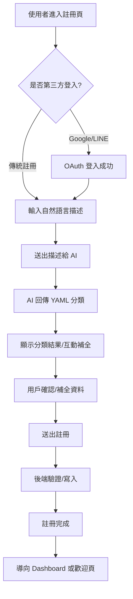

# AI 引導式註冊流程規劃（NexusERP）

---

## 1. 流程目標
- 以 AI 導引方式協助新用戶完成註冊，並自動判斷其所屬行業、業務單位等分類。
- 提升註冊體驗，減少用戶選單操作，強化資料正確性與結構化。
- 支援多行業、多業務單位、複雜經營型態。

---

## 2. 流程步驟

### 2.1 基本資料填寫（優先第三方登入）

- **推薦用戶使用 Google、LINE 等第三方登入（OAuth2），自動取得姓名、信箱等基本資料，無需手動填寫。**
- **如用戶不願意使用第三方登入，才顯示傳統註冊表單（姓名、信箱、密碼）。**
- **登入成功後，直接進入 AI 引導式經營內容描述步驟。**

### 2.2 自然語言描述經營內容
- 用戶以自然語言描述其經營業態、公司型態、主要產品/服務、規模等。
  - 範例：「我有一間養雞場，也在菜市場賣雞肉。」
  - 範例：「我們是做電子商務，賣3C產品。」

### 2.3 AI NLP 分析與分類
- AI 解析用戶描述，自動推薦一個或多個行業分類與業務單位。
- AI 產生 YAML 格式回覆，內容包含：
  - 推薦行業分類（可多選）
  - 推薦業務單位（如有）
  - 主要產品/服務
  - 建議的資料結構（如公司/BU/行業/產品）
  - 需用戶確認的欄位

### 2.4 用戶確認與補充
- 顯示 AI 推薦分類，請用戶確認或修正。
- 若有缺漏，AI 進一步詢問（如規模、員工數、主要市場等）。

### 2.5 結構化資料建立
- 用戶確認後，系統自動建立對應的公司、業務單位、行業標籤等結構化資料。
- 註冊完成，進入系統。

---

## 3. AI 互動細節

### 3.1 問答設計
- 問題設計以「引導用戶補全必要資訊」為主。
- AI 需根據用戶描述自動判斷缺漏欄位，逐步詢問。
- 回覆格式統一為 YAML，不使用 JSON。

### 3.2 AI 回覆格式規範（YAML）
```yaml
user_profile:
  name: "王大明"
  email: "user@example.com"
  description: "我有一間養雞場，也在菜市場賣雞肉。"
classification:
  industries:
    - 農業-養殖
    - 零售業
  business_units:
    - name: "養雞場"
      industry: "農業-養殖"
    - name: "雞肉攤"
      industry: "零售業"
  main_products:
    - "雞隻"
    - "雞肉"
  ai_confidence: 0.92
  need_user_confirmation:
    - industries
    - business_units
    - main_products
next_questions:
  - "請問您的公司名稱是？"
  - "請問員工人數大約多少？"
```

### 3.3 範例互動流程

#### Step 1: 用戶描述
> 用戶：「我有一間養雞場，也在菜市場賣雞肉。」

#### Step 2: AI 回覆（YAML）
```yaml
user_profile:
  name: "（用戶輸入）"
  email: "（用戶輸入）"
  description: "我有一間養雞場，也在菜市場賣雞肉。"
classification:
  industries:
    - 農業-養殖
    - 零售業
  business_units:
    - name: "養雞場"
      industry: "農業-養殖"
    - name: "雞肉攤"
      industry: "零售業"
  main_products:
    - "雞隻"
    - "雞肉"
  ai_confidence: 0.92
  need_user_confirmation:
    - industries
    - business_units
    - main_products
next_questions:
  - "請問您的公司名稱是？"
  - "請問員工人數大約多少？"
```

#### Step 3: 用戶確認/補充
> 用戶：「公司叫做大明畜牧，員工5人。」

#### Step 4: AI 整理最終結構
```yaml
user_profile:
  name: "王大明"
  email: "user@example.com"
  description: "我有一間養雞場，也在菜市場賣雞肉。"
company:
  name: "大明畜牧"
  employees: 5
classification:
  industries:
    - 農業-養殖
    - 零售業
  business_units:
    - name: "養雞場"
      industry: "農業-養殖"
    - name: "雞肉攤"
      industry: "零售業"
  main_products:
    - "雞隻"
    - "雞肉"
  ai_confidence: 0.92
```

---

## 4. AI 參數與設定
- **OpenRouter Key**: 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
- **Model**: qwen/qwen-2.5-72b-instruct:free
- **回覆格式**: YAML（嚴禁使用 JSON）
- **語言**: 中文（正體）
- **互動模式**: 多輪問答，直到所有必要欄位補全

---

## 5. 用戶體驗重點
- 註冊過程簡潔、互動式、無需繁瑣選單
- AI 自動判斷分類，減少用戶負擔
- 支援多行業、多業務單位、複雜經營型態
- 可隨時修正 AI 推薦分類
- 所有資料最終結構化存入用戶設定檔

---

## 6. 延伸應用
- 註冊後可持續用 AI 輔助完善公司/業務單位/產品等資料
- 可結合語音輸入、OCR 文件補全等進階功能

---

> 本文件經確認後，將納入總規劃與開發步驟，並同步更新相關文件。 

## 註冊流程圖

