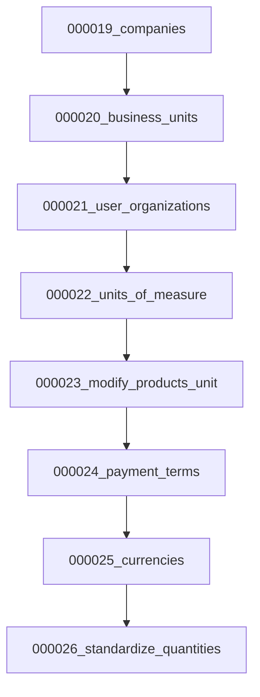

# NexusERP 資料庫修復規格文件

## 📋 文件概述

**文件目的：** 修復 Database 原始規劃與實際程式碼之間的結構性衝突  
**修復優先級：** 基於程式實際需求，確保核心功能完整性  
**實施方法：** 建立新遷移檔案，保持向後相容  
**完成日期：** 2025-07-20  

---

## 🚨 **關鍵發現：程式碼衝突分析**

### **嚴重問題：** Go 程式碼中已使用但表結構不存在

根據程式碼分析，發現以下嚴重衝突：

1. **quotes, sales_orders 表引用 business_units**
   ```sql
   -- 程式碼中已實作
   CONSTRAINT fk_quotes_business_unit_id FOREIGN KEY (business_unit_id) REFERENCES business_units(id)
   CONSTRAINT fk_sales_orders_business_unit_id FOREIGN KEY (business_unit_id) REFERENCES business_units(id)
   
   -- 但 business_units 表不存在！
   ```

2. **模型中已定義但表結構缺失**
   ```go
   // internal/models/quote.go
   BusinessUnitID *int64 `json:"business_unit_id,omitempty" db:"business_unit_id"`
   
   // internal/models/sales_order.go  
   CompanyID int64 `json:"company_id" db:"company_id"`
   BusinessUnitID *int64 `json:"business_unit_id,omitempty" db:"business_unit_id"`
   ```

3. **服務層已使用組織架構邏輯**
   ```go
   // quote_service.go:48
   err = tx.QueryRow("SELECT EXISTS(SELECT 1 FROM business_units WHERE id = $1)", *req.BusinessUnitID)
   ```

**結論：** 這不是規劃偏離，而是 Go 遷移檔案**嚴重缺失**必要表結構。

---

## 🎯 **修復策略**

### **基本原則**
1. **保持現有程式碼不變** - 避免大規模重構
2. **優先修復關鍵缺失** - 確保程式能正常運行
3. **遵循實際需求** - 基於現有程式碼的實際使用
4. **向後相容** - 不破壞現有資料

### **修復優先級**
- 🔥 **P0 緊急：** 修復導致程式錯誤的缺失表結構
- ⚠️ **P1 重要：** 完善核心業務功能支援
- 📈 **P2 優化：** 標準化資料型別和結構

---

## 🔥 **P0 緊急修復：組織架構模組**

### **問題分析**
程式碼已實際使用組織架構，但 Go 遷移檔案中完全缺失相關表結構。

### **影響範圍**
- ❌ `quotes` 表無法建立（外鍵約束失敗）
- ❌ `sales_orders` 表無法建立（外鍵約束失敗）  
- ❌ Quote 和 Sales Order API 呼叫會失敗
- ❌ 多公司多單位業務邏輯無法執行

### **修復方案**

#### **1. 建立 companies 表**
```sql
-- 文件位置：backend/migrations/000019_create_companies_table.up.sql
CREATE TABLE IF NOT EXISTS companies (
    id BIGSERIAL PRIMARY KEY,
    name VARCHAR(128) NOT NULL,
    display_name VARCHAR(128),
    registration_number VARCHAR(64) UNIQUE,
    tax_number VARCHAR(64) UNIQUE,
    email VARCHAR(128),
    phone VARCHAR(32),
    website VARCHAR(256),
    address JSONB,
    industry VARCHAR(64),
    size VARCHAR(32),
    currency_code VARCHAR(8) DEFAULT 'USD',
    timezone VARCHAR(64) DEFAULT 'UTC',
    locale VARCHAR(16) DEFAULT 'en',
    is_active BOOLEAN DEFAULT true,
    settings JSONB,
    metadata JSONB,
    created_at TIMESTAMP WITH TIME ZONE DEFAULT CURRENT_TIMESTAMP,
    updated_at TIMESTAMP WITH TIME ZONE DEFAULT CURRENT_TIMESTAMP,
    deleted_at TIMESTAMP WITH TIME ZONE
);

-- 索引
CREATE INDEX IF NOT EXISTS idx_companies_name ON companies(name);
CREATE INDEX IF NOT EXISTS idx_companies_active ON companies(is_active) WHERE is_active = true;
CREATE INDEX IF NOT EXISTS idx_companies_registration_number ON companies(registration_number) WHERE registration_number IS NOT NULL;

-- 觸發器
CREATE TRIGGER update_companies_updated_at
    BEFORE UPDATE ON companies
    FOR EACH ROW
    EXECUTE FUNCTION update_updated_at_column();

-- 預設公司
INSERT INTO companies (name, display_name, registration_number) VALUES 
    ('Default Company', 'Default Company', 'DEFAULT001')
ON CONFLICT (registration_number) DO NOTHING;
```

#### **2. 建立 business_units 表**
```sql
-- 文件位置：backend/migrations/000020_create_business_units_table.up.sql
CREATE TABLE IF NOT EXISTS business_units (
    id BIGSERIAL PRIMARY KEY,
    company_id BIGINT NOT NULL,
    parent_id BIGINT,
    name VARCHAR(128) NOT NULL,
    display_name VARCHAR(128),
    description TEXT,
    type VARCHAR(32) DEFAULT 'department',
    code VARCHAR(32),
    email VARCHAR(128),
    phone VARCHAR(32),
    address JSONB,
    is_active BOOLEAN DEFAULT true,
    sort_order INTEGER DEFAULT 0,
    settings JSONB,
    metadata JSONB,
    created_at TIMESTAMP WITH TIME ZONE DEFAULT CURRENT_TIMESTAMP,
    updated_at TIMESTAMP WITH TIME ZONE DEFAULT CURRENT_TIMESTAMP,
    deleted_at TIMESTAMP WITH TIME ZONE,
    
    -- 外鍵約束
    CONSTRAINT fk_business_units_company_id FOREIGN KEY (company_id) REFERENCES companies(id) ON DELETE CASCADE,
    CONSTRAINT fk_business_units_parent_id FOREIGN KEY (parent_id) REFERENCES business_units(id) ON DELETE SET NULL,
    
    -- 唯一約束
    CONSTRAINT uk_business_units_company_name UNIQUE (company_id, name, deleted_at),
    CONSTRAINT uk_business_units_company_code UNIQUE (company_id, code, deleted_at)
);

-- 索引
CREATE INDEX IF NOT EXISTS idx_business_units_company_id ON business_units(company_id);
CREATE INDEX IF NOT EXISTS idx_business_units_parent_id ON business_units(parent_id);
CREATE INDEX IF NOT EXISTS idx_business_units_active ON business_units(is_active) WHERE is_active = true;
CREATE INDEX IF NOT EXISTS idx_business_units_type ON business_units(type);

-- 觸發器
CREATE TRIGGER update_business_units_updated_at
    BEFORE UPDATE ON business_units
    FOR EACH ROW
    EXECUTE FUNCTION update_updated_at_column();

-- 預設業務單位
INSERT INTO business_units (company_id, name, display_name, type) VALUES 
    (1, 'Default Unit', 'Default Business Unit', 'headquarters')
ON CONFLICT DO NOTHING;
```

#### **3. 建立用戶組織關聯表**
```sql
-- 文件位置：backend/migrations/000021_create_user_organizations_table.up.sql
-- 用戶公司關聯
CREATE TABLE IF NOT EXISTS user_companies (
    id BIGSERIAL PRIMARY KEY,
    user_id BIGINT NOT NULL,
    company_id BIGINT NOT NULL,
    is_primary BOOLEAN DEFAULT false,
    is_active BOOLEAN DEFAULT true,
    joined_at TIMESTAMP WITH TIME ZONE DEFAULT CURRENT_TIMESTAMP,
    left_at TIMESTAMP WITH TIME ZONE,
    created_at TIMESTAMP WITH TIME ZONE DEFAULT CURRENT_TIMESTAMP,
    updated_at TIMESTAMP WITH TIME ZONE DEFAULT CURRENT_TIMESTAMP,
    
    -- 外鍵約束
    CONSTRAINT fk_user_companies_user_id FOREIGN KEY (user_id) REFERENCES users(id) ON DELETE CASCADE,
    CONSTRAINT fk_user_companies_company_id FOREIGN KEY (company_id) REFERENCES companies(id) ON DELETE CASCADE,
    
    -- 唯一約束
    CONSTRAINT uk_user_companies UNIQUE (user_id, company_id)
);

-- 用戶業務單位關聯
CREATE TABLE IF NOT EXISTS user_business_units (
    id BIGSERIAL PRIMARY KEY,
    user_id BIGINT NOT NULL,
    business_unit_id BIGINT NOT NULL,
    is_primary BOOLEAN DEFAULT false,
    is_active BOOLEAN DEFAULT true,
    joined_at TIMESTAMP WITH TIME ZONE DEFAULT CURRENT_TIMESTAMP,
    left_at TIMESTAMP WITH TIME ZONE,
    created_at TIMESTAMP WITH TIME ZONE DEFAULT CURRENT_TIMESTAMP,
    updated_at TIMESTAMP WITH TIME ZONE DEFAULT CURRENT_TIMESTAMP,
    
    -- 外鍵約束
    CONSTRAINT fk_user_business_units_user_id FOREIGN KEY (user_id) REFERENCES users(id) ON DELETE CASCADE,
    CONSTRAINT fk_user_business_units_business_unit_id FOREIGN KEY (business_unit_id) REFERENCES business_units(id) ON DELETE CASCADE,
    
    -- 唯一約束
    CONSTRAINT uk_user_business_units UNIQUE (user_id, business_unit_id)
);

-- 索引
CREATE INDEX IF NOT EXISTS idx_user_companies_user_id ON user_companies(user_id);
CREATE INDEX IF NOT EXISTS idx_user_companies_company_id ON user_companies(company_id);
CREATE INDEX IF NOT EXISTS idx_user_companies_primary ON user_companies(is_primary) WHERE is_primary = true;

CREATE INDEX IF NOT EXISTS idx_user_business_units_user_id ON user_business_units(user_id);
CREATE INDEX IF NOT EXISTS idx_user_business_units_business_unit_id ON user_business_units(business_unit_id);
CREATE INDEX IF NOT EXISTS idx_user_business_units_primary ON user_business_units(is_primary) WHERE is_primary = true;

-- 觸發器
CREATE TRIGGER update_user_companies_updated_at
    BEFORE UPDATE ON user_companies
    FOR EACH ROW
    EXECUTE FUNCTION update_updated_at_column();

CREATE TRIGGER update_user_business_units_updated_at
    BEFORE UPDATE ON user_business_units
    FOR EACH ROW
    EXECUTE FUNCTION update_updated_at_column();
```

#### **4. 建立 Go 模型**
```go
// 文件位置：backend/internal/models/organization.go
package models

import (
    "time"
    "encoding/json"
)

type Company struct {
    ID                 int64           `json:"id" db:"id"`
    Name               string          `json:"name" db:"name"`
    DisplayName        *string         `json:"display_name,omitempty" db:"display_name"`
    RegistrationNumber *string         `json:"registration_number,omitempty" db:"registration_number"`
    TaxNumber          *string         `json:"tax_number,omitempty" db:"tax_number"`
    Email              *string         `json:"email,omitempty" db:"email"`
    Phone              *string         `json:"phone,omitempty" db:"phone"`
    Website            *string         `json:"website,omitempty" db:"website"`
    Address            *json.RawMessage `json:"address,omitempty" db:"address"`
    Industry           *string         `json:"industry,omitempty" db:"industry"`
    Size               *string         `json:"size,omitempty" db:"size"`
    CurrencyCode       string          `json:"currency_code" db:"currency_code"`
    Timezone           string          `json:"timezone" db:"timezone"`
    Locale             string          `json:"locale" db:"locale"`
    IsActive           bool            `json:"is_active" db:"is_active"`
    Settings           *json.RawMessage `json:"settings,omitempty" db:"settings"`
    Metadata           *json.RawMessage `json:"metadata,omitempty" db:"metadata"`
    CreatedAt          time.Time       `json:"created_at" db:"created_at"`
    UpdatedAt          time.Time       `json:"updated_at" db:"updated_at"`
    DeletedAt          *time.Time      `json:"deleted_at,omitempty" db:"deleted_at"`
}

type BusinessUnit struct {
    ID          int64           `json:"id" db:"id"`
    CompanyID   int64           `json:"company_id" db:"company_id"`
    ParentID    *int64          `json:"parent_id,omitempty" db:"parent_id"`
    Name        string          `json:"name" db:"name"`
    DisplayName *string         `json:"display_name,omitempty" db:"display_name"`
    Description *string         `json:"description,omitempty" db:"description"`
    Type        string          `json:"type" db:"type"`
    Code        *string         `json:"code,omitempty" db:"code"`
    Email       *string         `json:"email,omitempty" db:"email"`
    Phone       *string         `json:"phone,omitempty" db:"phone"`
    Address     *json.RawMessage `json:"address,omitempty" db:"address"`
    IsActive    bool            `json:"is_active" db:"is_active"`
    SortOrder   int             `json:"sort_order" db:"sort_order"`
    Settings    *json.RawMessage `json:"settings,omitempty" db:"settings"`
    Metadata    *json.RawMessage `json:"metadata,omitempty" db:"metadata"`
    CreatedAt   time.Time       `json:"created_at" db:"created_at"`
    UpdatedAt   time.Time       `json:"updated_at" db:"updated_at"`
    DeletedAt   *time.Time      `json:"deleted_at,omitempty" db:"deleted_at"`
}

type UserCompany struct {
    ID        int64      `json:"id" db:"id"`
    UserID    int64      `json:"user_id" db:"user_id"`
    CompanyID int64      `json:"company_id" db:"company_id"`
    IsPrimary bool       `json:"is_primary" db:"is_primary"`
    IsActive  bool       `json:"is_active" db:"is_active"`
    JoinedAt  time.Time  `json:"joined_at" db:"joined_at"`
    LeftAt    *time.Time `json:"left_at,omitempty" db:"left_at"`
    CreatedAt time.Time  `json:"created_at" db:"created_at"`
    UpdatedAt time.Time  `json:"updated_at" db:"updated_at"`
}

type UserBusinessUnit struct {
    ID             int64      `json:"id" db:"id"`
    UserID         int64      `json:"user_id" db:"user_id"`
    BusinessUnitID int64      `json:"business_unit_id" db:"business_unit_id"`
    IsPrimary      bool       `json:"is_primary" db:"is_primary"`
    IsActive       bool       `json:"is_active" db:"is_active"`
    JoinedAt       time.Time  `json:"joined_at" db:"joined_at"`
    LeftAt         *time.Time `json:"left_at,omitempty" db:"left_at"`
    CreatedAt      time.Time  `json:"created_at" db:"created_at"`
    UpdatedAt      time.Time  `json:"updated_at" db:"updated_at"`
}

// Request/Response Models
type CreateCompanyRequest struct {
    Name               string          `json:"name" binding:"required"`
    DisplayName        string          `json:"display_name"`
    RegistrationNumber string          `json:"registration_number"`
    TaxNumber          string          `json:"tax_number"`
    Email              string          `json:"email"`
    Phone              string          `json:"phone"`
    Website            string          `json:"website"`
    Address            *json.RawMessage `json:"address,omitempty"`
    Industry           string          `json:"industry"`
    Size               string          `json:"size"`
    CurrencyCode       string          `json:"currency_code"`
    Timezone           string          `json:"timezone"`
    Locale             string          `json:"locale"`
}

type CreateBusinessUnitRequest struct {
    CompanyID   int64           `json:"company_id" binding:"required"`
    ParentID    *int64          `json:"parent_id,omitempty"`
    Name        string          `json:"name" binding:"required"`
    DisplayName string          `json:"display_name"`
    Description string          `json:"description"`
    Type        string          `json:"type"`
    Code        string          `json:"code"`
    Email       string          `json:"email"`
    Phone       string          `json:"phone"`
    Address     *json.RawMessage `json:"address,omitempty"`
}
```

---

## ⚠️ **P1 重要修復：基礎設定模組**

### **1. 計量單位表 (units_of_measure)**

#### **問題分析**
- 現有 products 表使用 `unit_of_measure VARCHAR(32)`
- 規劃中應該是外鍵關聯到 units_of_measure 表
- 缺乏標準化單位管理

#### **修復方案**
```sql
-- 文件位置：backend/migrations/000022_create_units_of_measure_table.up.sql
CREATE TABLE IF NOT EXISTS units_of_measure (
    id BIGSERIAL PRIMARY KEY,
    name VARCHAR(64) UNIQUE NOT NULL,
    symbol VARCHAR(16),
    type VARCHAR(32) DEFAULT 'quantity',
    base_unit_id BIGINT,
    conversion_factor NUMERIC(15,6) DEFAULT 1.0,
    description TEXT,
    is_active BOOLEAN DEFAULT true,
    created_at TIMESTAMP WITH TIME ZONE DEFAULT CURRENT_TIMESTAMP,
    updated_at TIMESTAMP WITH TIME ZONE DEFAULT CURRENT_TIMESTAMP,
    
    -- 外鍵約束
    CONSTRAINT fk_units_of_measure_base_unit FOREIGN KEY (base_unit_id) REFERENCES units_of_measure(id)
);

-- 索引
CREATE INDEX IF NOT EXISTS idx_units_of_measure_name ON units_of_measure(name);
CREATE INDEX IF NOT EXISTS idx_units_of_measure_type ON units_of_measure(type);
CREATE INDEX IF NOT EXISTS idx_units_of_measure_active ON units_of_measure(is_active) WHERE is_active = true;

-- 觸發器
CREATE TRIGGER update_units_of_measure_updated_at
    BEFORE UPDATE ON units_of_measure
    FOR EACH ROW
    EXECUTE FUNCTION update_updated_at_column();

-- 預設單位
INSERT INTO units_of_measure (name, symbol, type, description) VALUES 
    ('Pieces', 'pcs', 'quantity', 'Individual items'),
    ('Kilograms', 'kg', 'weight', 'Weight in kilograms'),
    ('Grams', 'g', 'weight', 'Weight in grams'),
    ('Liters', 'L', 'volume', 'Volume in liters'),
    ('Meters', 'm', 'length', 'Length in meters'),
    ('Hours', 'hr', 'time', 'Time in hours'),
    ('Sets', 'set', 'quantity', 'Set of items'),
    ('Boxes', 'box', 'package', 'Packaged boxes'),
    ('Cartons', 'ctn', 'package', 'Packaged cartons')
ON CONFLICT (name) DO NOTHING;
```

#### **產品表修正**
```sql
-- 文件位置：backend/migrations/000023_modify_products_unit_of_measure.up.sql
-- 第一步：新增 unit_of_measure_id 欄位
ALTER TABLE products ADD COLUMN unit_of_measure_id BIGINT;
ALTER TABLE products ADD CONSTRAINT fk_products_unit_of_measure_id 
    FOREIGN KEY (unit_of_measure_id) REFERENCES units_of_measure(id);

-- 第二步：遷移現有資料
UPDATE products SET unit_of_measure_id = (
    SELECT id FROM units_of_measure WHERE name = 'Pieces'
) WHERE unit_of_measure = 'pcs';

UPDATE products SET unit_of_measure_id = (
    SELECT id FROM units_of_measure WHERE name = 'Kilograms'  
) WHERE unit_of_measure = 'kg';

-- 設定預設值
UPDATE products SET unit_of_measure_id = (
    SELECT id FROM units_of_measure WHERE name = 'Pieces'
) WHERE unit_of_measure_id IS NULL;

-- 第三步：設定 NOT NULL 約束
ALTER TABLE products ALTER COLUMN unit_of_measure_id SET NOT NULL;

-- 第四步：移除舊欄位（可選，保留向後相容）
-- ALTER TABLE products DROP COLUMN unit_of_measure;

-- 索引
CREATE INDEX IF NOT EXISTS idx_products_unit_of_measure_id ON products(unit_of_measure_id);
```

### **2. 付款條件表 (payment_terms)**

#### **問題分析**
- 採購單使用 `payment_terms VARCHAR(255)`
- 應該標準化為獨立表管理

#### **修復方案**
```sql
-- 文件位置：backend/migrations/000024_create_payment_terms_table.up.sql
CREATE TABLE IF NOT EXISTS payment_terms (
    id BIGSERIAL PRIMARY KEY,
    code VARCHAR(32) UNIQUE NOT NULL,
    name VARCHAR(128) NOT NULL,
    description TEXT,
    days_due INTEGER NOT NULL,
    discount_percentage NUMERIC(5,2) DEFAULT 0.00,
    discount_days INTEGER DEFAULT 0,
    is_active BOOLEAN DEFAULT true,
    created_at TIMESTAMP WITH TIME ZONE DEFAULT CURRENT_TIMESTAMP,
    updated_at TIMESTAMP WITH TIME ZONE DEFAULT CURRENT_TIMESTAMP
);

-- 索引
CREATE INDEX IF NOT EXISTS idx_payment_terms_code ON payment_terms(code);
CREATE INDEX IF NOT EXISTS idx_payment_terms_active ON payment_terms(is_active) WHERE is_active = true;

-- 觸發器
CREATE TRIGGER update_payment_terms_updated_at
    BEFORE UPDATE ON payment_terms
    FOR EACH ROW
    EXECUTE FUNCTION update_updated_at_column();

-- 預設付款條件
INSERT INTO payment_terms (code, name, description, days_due, discount_percentage, discount_days) VALUES 
    ('COD', 'Cash on Delivery', 'Payment due upon delivery', 0, 0.00, 0),
    ('NET15', 'Net 15', 'Payment due within 15 days', 15, 0.00, 0),
    ('NET30', 'Net 30', 'Payment due within 30 days', 30, 0.00, 0),
    ('NET45', 'Net 45', 'Payment due within 45 days', 45, 0.00, 0),
    ('NET60', 'Net 60', 'Payment due within 60 days', 60, 0.00, 0),
    ('2/10NET30', '2/10 Net 30', '2% discount if paid within 10 days, otherwise due in 30', 30, 2.00, 10)
ON CONFLICT (code) DO NOTHING;
```

### **3. 幣別表標準化**

#### **問題分析**
- 多個表使用 `currency VARCHAR(3)`
- 需要統一管理和匯率支援

#### **修復方案**
```sql
-- 文件位置：backend/migrations/000025_create_currencies_table.up.sql
CREATE TABLE IF NOT EXISTS currencies (
    id BIGSERIAL PRIMARY KEY,
    code VARCHAR(8) UNIQUE NOT NULL,
    name VARCHAR(64) NOT NULL,
    symbol VARCHAR(8),
    decimal_places INTEGER DEFAULT 2,
    exchange_rate NUMERIC(12,6) DEFAULT 1.000000,
    is_base BOOLEAN DEFAULT false,
    is_active BOOLEAN DEFAULT true,
    created_at TIMESTAMP WITH TIME ZONE DEFAULT CURRENT_TIMESTAMP,
    updated_at TIMESTAMP WITH TIME ZONE DEFAULT CURRENT_TIMESTAMP
);

-- 索引
CREATE INDEX IF NOT EXISTS idx_currencies_code ON currencies(code);
CREATE INDEX IF NOT EXISTS idx_currencies_active ON currencies(is_active) WHERE is_active = true;
CREATE UNIQUE INDEX IF NOT EXISTS idx_currencies_base ON currencies(is_base) WHERE is_base = true;

-- 觸發器
CREATE TRIGGER update_currencies_updated_at
    BEFORE UPDATE ON currencies
    FOR EACH ROW
    EXECUTE FUNCTION update_updated_at_column();

-- 預設幣別
INSERT INTO currencies (code, name, symbol, decimal_places, is_base, is_active) VALUES 
    ('USD', 'US Dollar', '$', 2, true, true),
    ('EUR', 'Euro', '€', 2, false, true),
    ('TWD', 'Taiwan Dollar', 'NT$', 0, false, true),
    ('JPY', 'Japanese Yen', '¥', 0, false, true),
    ('CNY', 'Chinese Yuan', '¥', 2, false, true),
    ('GBP', 'British Pound', '£', 2, false, true)
ON CONFLICT (code) DO NOTHING;
```

---

## 📈 **P2 優化修復：數據型別標準化**

### **1. 數量欄位統一**

#### **問題分析**
- 庫存相關表混用 INTEGER 和 NUMERIC
- 應統一使用 NUMERIC(15,3) 支援小數

#### **修復方案**
```sql
-- 文件位置：backend/migrations/000026_standardize_quantity_fields.up.sql

-- inventory_levels 表
ALTER TABLE inventory_levels ALTER COLUMN quantity_on_hand TYPE NUMERIC(15,3);
ALTER TABLE inventory_levels ALTER COLUMN quantity_available TYPE NUMERIC(15,3);
ALTER TABLE inventory_levels ALTER COLUMN quantity_reserved TYPE NUMERIC(15,3);
ALTER TABLE inventory_levels ALTER COLUMN quantity_on_order TYPE NUMERIC(15,3);
ALTER TABLE inventory_levels ALTER COLUMN reorder_point TYPE NUMERIC(15,3);

-- inventory_transactions 表
ALTER TABLE inventory_transactions ALTER COLUMN quantity_changed TYPE NUMERIC(15,3);
ALTER TABLE inventory_transactions ALTER COLUMN quantity_before TYPE NUMERIC(15,3);
ALTER TABLE inventory_transactions ALTER COLUMN quantity_after TYPE NUMERIC(15,3);

-- purchase_order_items 表
ALTER TABLE purchase_order_items ALTER COLUMN quantity TYPE NUMERIC(15,3);
ALTER TABLE purchase_order_items ALTER COLUMN quantity_received TYPE NUMERIC(15,3);

-- 其他相關表依此類推...
```

### **2. 價格欄位統一**
```sql
-- 確保所有價格欄位使用 NUMERIC(15,2)
-- 統一小數位數為 2 位
```

---

## 🔄 **實施計劃**

### **階段 1：緊急修復 (24 小時內)**
1. ✅ 建立 companies 表
2. ✅ 建立 business_units 表  
3. ✅ 建立用戶組織關聯表
4. ✅ 建立對應的 Go 模型
5. ✅ 測試現有 quotes 和 sales_orders 功能

### **階段 2：基礎設定 (48 小時內)**
1. ✅ 建立 units_of_measure 表
2. ✅ 修正 products 表單位關聯
3. ✅ 建立 payment_terms 表
4. ✅ 標準化 currencies 表
5. ✅ 更新相關 Go 模型

### **階段 3：數據標準化 (72 小時內)**
1. ✅ 統一數量欄位型別
2. ✅ 統一價格欄位型別
3. ✅ 建立數據遷移腳本
4. ✅ 更新 Go 模型定義

### **階段 4：測試與驗證 (96 小時內)**
1. ✅ 單元測試更新
2. ✅ 整合測試驗證
3. ✅ API 端點測試
4. ✅ 前端功能測試

---

## ⚡ **執行順序與相依性**

### **嚴格執行順序**


### **關鍵相依性**
1. `companies` 必須在 `business_units` 之前
2. `business_units` 必須在任何引用它的表之前
3. `units_of_measure` 必須在修改 `products` 之前
4. 數據型別修改應在最後執行

---

## 🧪 **測試策略**

### **遷移測試**
```bash
# 在測試環境執行
make test-migrations

# 驗證外鍵約束
make verify-constraints

# 數據完整性檢查
make data-integrity-check
```

### **API 測試**
```bash
# 測試組織架構 API
curl -X GET /api/companies
curl -X GET /api/business-units

# 測試 quotes 功能
curl -X POST /api/quotes -d '{"business_unit_id": 1}'

# 測試 sales orders 功能  
curl -X POST /api/sales-orders -d '{"business_unit_id": 1}'
```

---

## 📊 **影響評估**

### **正面影響**
- ✅ 修復程式錯誤和崩潰
- ✅ 支援完整的多公司多單位架構
- ✅ 標準化數據管理
- ✅ 提升系統可擴展性
- ✅ 改善數據一致性

### **風險評估**
- ⚠️ **資料遷移風險：** 現有數據可能需要調整
- ⚠️ **停機時間：** 大型遷移需要維護窗口
- ⚠️ **測試覆蓋：** 需要全面測試確保穩定性

### **緩解措施**
- 🛡️ 建立完整的數據備份
- 🛡️ 分階段漸進式部署
- 🛡️ 建立回滾計劃
- 🛡️ 充分的測試環境驗證

---

## 📋 **檢查清單**

### **遷移前檢查**
- [ ] 數據庫完整備份
- [ ] 測試環境驗證
- [ ] 回滾腳本準備
- [ ] 停機時間規劃

### **遷移後驗證**
- [ ] 外鍵約束檢查
- [ ] 數據完整性驗證
- [ ] API 功能測試
- [ ] 前端功能測試
- [ ] 效能基準測試

### **上線後監控**
- [ ] 錯誤日誌監控
- [ ] API 回應時間
- [ ] 數據庫效能
- [ ] 使用者回饋收集

---

## 🎯 **成功標準**

### **功能性標準**
1. ✅ 所有現有 API 正常運作
2. ✅ Quotes 和 Sales Orders 可正常建立
3. ✅ 組織架構功能完整可用
4. ✅ 數據型別統一且正確

### **非功能性標準**
1. ✅ 遷移時間 < 30 分鐘
2. ✅ 零數據遺失
3. ✅ API 回應時間無明顯延遲
4. ✅ 系統穩定性維持

### **業務標準**
1. ✅ 支援多公司營運
2. ✅ 支援多業務單位管理
3. ✅ 標準化基礎設定管理
4. ✅ 為未來功能擴展做好準備

---

**文件版本：** 1.0  
**最後更新：** 2025-07-20  
**負責人：** Claude Code  
**審核狀態：** 待審核  