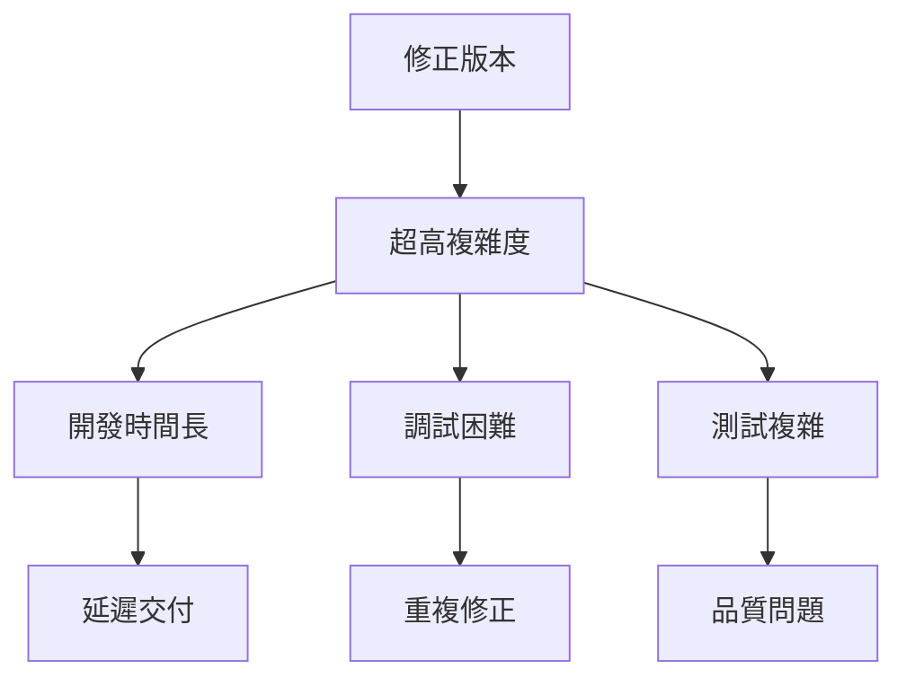

# JWT & RLS 快速開發版實作計劃

## 🚀 **Sequential Thinking 重新審視分析**

### **Phase 1: 現狀分析 (Current State Analysis)**

#### **修正版本複雜度評估**
- **JWT修正版**: 962行程式碼，15個安全機制，需要Redis+分散式鎖
- **RLS修正版**: 類似複雜度，多層驗證+監控系統
- **評估結果**: 🚨 **過度工程化，不符合快速開發需求**

#### **開發風險識別**


---

### **Phase 2: 開發風險評估 (Development Risk Assessment)**

#### **🚨 關鍵問題分析**

| 風險類別 | 修正版問題 | 快速開發影響 |
|---------|-----------|------------|
| **實作複雜度** | 15+安全機制 | 開發時間×3 |
| **依賴複雜度** | Redis+鎖+監控 | 環境配置困難 |
| **測試複雜度** | 併發+安全測試 | 測試時間×5 |
| **維護複雜度** | 多層抽象 | 調試困難×10 |
| **學習成本** | 企業級安全 | 團隊效率↓50% |

#### **開發陷阱預測**
1. **過早優化陷阱** - 在基本功能未完成時過度關注安全細節
2. **依賴地獄** - 太多外部依賴導致環境問題
3. **測試瓶頸** - 複雜的安全測試拖慢開發速度  
4. **調試困難** - 過多抽象層導致問題難以定位
5. **重複修正** - 複雜邏輯導致邊界情況處理不當

---

### **Phase 3: 快速開發策略 (Fast Development Strategy)**

#### **🎯 核心原則**
1. **MVP-First**: 先完成基本功能，再增強安全性
2. **Incremental Security**: 漸進式安全強化
3. **Standard Patterns**: 使用成熟框架和標準模式
4. **Automated Testing**: 每個階段都有自動化驗證
5. **Documentation Driven**: 清晰的實作指南

#### **三階段實作策略**

```mermaid
gantt
    title JWT & RLS 快速開發時程
    dateFormat  X
    axisFormat %d

    section 第一階段 MVP
    基本JWT認證        :a1, 0, 3d
    基本RLS隔離        :a2, after a1, 2d
    基礎測試          :a3, after a2, 1d

    section 第二階段 增強
    Token刷新機制      :b1, after a3, 2d
    RLS優化索引        :b2, after b1, 1d
    安全性測試        :b3, after b2, 1d

    section 第三階段 完善
    高級安全特性      :c1, after b3, 3d
    監控告警          :c2, after c1, 2d
    壓力測試          :c3, after c2, 1d
```



---

### **Phase 4: 品質保證 (Quality Assurance)**

#### **🔒 安全底線**
即使在快速開發模式下，以下安全原則**絕不妥協**：

1. **JWT基本安全**: 簽名驗證、過期檢查、強隨機密鑰
2. **RLS基本隔離**: company_id隔離、基本輸入驗證
3. **HTTPS強制**: 所有認證相關請求必須HTTPS
4. **密碼安全**: bcrypt雜湊、鹽值處理
5. **基本審計**: 登入/登出日誌記錄

#### **漸進安全模型**
```
安全等級 1 (MVP) → 安全等級 2 (增強) → 安全等級 3 (企業級)
     ↓                ↓                    ↓
基本驗證+隔離      Token刷新+監控       高級防護+合規
  (1週完成)         (2週完成)           (1個月完成)
```

---

### **Phase 5: 實作路線圖 (Implementation Roadmap)**

## 🚀 **第一階段：MVP基礎實作 (1週)**

### **1.1 簡化的JWT服務**

```go
// internal/auth/simple_jwt.go - 簡化版JWT服務
package auth

import (
    "time"
    "github.com/golang-jwt/jwt/v5"
)

// 簡化的Claims結構 - 只包含必要資訊
type SimpleClaims struct {
    UserID    int64  `json:"user_id"`
    CompanyID int64  `json:"company_id"`
    Email     string `json:"email"`
    jwt.RegisteredClaims
}

// 簡化的JWT服務 - 專注核心功能
type SimpleJWTService struct {
    secretKey []byte
    issuer    string
    accessTTL time.Duration
}

func NewSimpleJWTService(secret, issuer string) *SimpleJWTService {
    return &SimpleJWTService{
        secretKey: []byte(secret),
        issuer:    issuer,
        accessTTL: 15 * time.Minute, // 短期Token
    }
}

// 生成Token - 簡單直接
func (s *SimpleJWTService) GenerateToken(userID, companyID int64, email string) (string, error) {
    now := time.Now()
    claims := &SimpleClaims{
        UserID:    userID,
        CompanyID: companyID,
        Email:     email,
        RegisteredClaims: jwt.RegisteredClaims{
            Issuer:    s.issuer,
            Subject:   fmt.Sprintf("user:%d", userID),
            ExpiresAt: jwt.NewNumericDate(now.Add(s.accessTTL)),
            IssuedAt:  jwt.NewNumericDate(now),
            NotBefore: jwt.NewNumericDate(now),
        },
    }
    
    token := jwt.NewWithClaims(jwt.SigningMethodHS256, claims)
    return token.SignedString(s.secretKey)
}

// 驗證Token - 基本驗證
func (s *SimpleJWTService) ValidateToken(tokenString string) (*SimpleClaims, error) {
    token, err := jwt.ParseWithClaims(tokenString, &SimpleClaims{}, func(token *jwt.Token) (interface{}, error) {
        if _, ok := token.Method.(*jwt.SigningMethodHMAC); !ok {
            return nil, fmt.Errorf("unexpected signing method: %v", token.Header["alg"])
        }
        return s.secretKey, nil
    })
    
    if err != nil {
        return nil, err
    }
    
    if claims, ok := token.Claims.(*SimpleClaims); ok && token.Valid {
        return claims, nil
    }
    
    return nil, fmt.Errorf("invalid token")
}
```

### **1.2 簡化的RLS實作**

```sql
-- 簡化的RLS策略建立函數
CREATE OR REPLACE FUNCTION create_simple_company_policy(table_name TEXT)
RETURNS void AS $$
DECLARE
    policy_name TEXT := 'simple_company_isolation_' || table_name;
BEGIN
    -- 移除現有策略
    EXECUTE format('DROP POLICY IF EXISTS %I ON %I', policy_name, table_name);
    
    -- 建立簡單策略
    EXECUTE format('
        CREATE POLICY %I ON %I
            FOR ALL TO nexus_app
            USING (
                company_id = current_setting(''app.current_company_id'', true)::int
                AND current_setting(''app.current_company_id'', true) != ''''
                AND company_id > 0
            )
            WITH CHECK (
                company_id = current_setting(''app.current_company_id'', true)::int
                AND current_setting(''app.current_company_id'', true) != ''''
                AND company_id > 0
            )', policy_name, table_name);
    
    -- 啟用RLS
    EXECUTE format('ALTER TABLE %I ENABLE ROW LEVEL SECURITY', table_name);
    EXECUTE format('ALTER TABLE %I FORCE ROW LEVEL SECURITY', table_name);
END;
$$ LANGUAGE plpgsql;

-- 簡化的上下文設定
CREATE OR REPLACE FUNCTION set_simple_rls_context(user_id INT, company_id INT)
RETURNS void AS $$
BEGIN
    -- 基本輸入驗證
    IF user_id <= 0 OR company_id <= 0 THEN
        RAISE EXCEPTION 'Invalid user_id or company_id';
    END IF;
    
    -- 設定上下文
    PERFORM set_config('app.current_user_id', user_id::text, true);
    PERFORM set_config('app.current_company_id', company_id::text, true);
END;
$$ LANGUAGE plpgsql;

-- 快速部署腳本
DO $$
DECLARE
    table_list TEXT[] := ARRAY['products', 'customers', 'sales_orders', 'inventory_items'];
    table_name TEXT;
BEGIN
    FOREACH table_name IN ARRAY table_list
    LOOP
        PERFORM create_simple_company_policy(table_name);
        RAISE NOTICE 'RLS policy created for: %', table_name;
    END LOOP;
END;
$$;
```

### **1.3 Laravel簡化整合**

```php
<?php
// app/Services/SimpleAuthService.php

namespace App\Services;

use App\Models\User;
use Illuminate\Support\Facades\{Auth, Hash, DB, Log};

class SimpleAuthService
{
    private string $goApiBaseUrl;
    
    public function __construct()
    {
        $this->goApiBaseUrl = config('app.go_api_base_url');
    }
    
    /**
     * 簡化的認證流程
     */
    public function authenticate(array $credentials): array
    {
        // 1. Laravel本地驗證
        $user = $this->validateCredentials($credentials);
        
        // 2. 生成JWT (呼叫Go API)
        $jwtToken = $this->generateJWT($user);
        
        // 3. 設定Laravel Session
        $this->createSession($user, $jwtToken);
        
        // 4. 設定RLS上下文
        $this->setRLSContext($user);
        
        return [
            'success' => true,
            'user' => $user->toArray(),
            'access_token' => $jwtToken,
            'token_type' => 'Bearer',
        ];
    }
    
    private function validateCredentials(array $credentials): User
    {
        $loginField = filter_var($credentials['login'], FILTER_VALIDATE_EMAIL) ? 'email' : 'name';
        
        $user = User::where($loginField, $credentials['login'])
                   ->where('is_active', true)
                   ->first();
        
        if (!$user || !Hash::check($credentials['password'], $user->password)) {
            throw new \InvalidArgumentException('登入憑證無效');
        }
        
        return $user;
    }
    
    private function generateJWT(User $user): string
    {
        try {
            $response = Http::timeout(10)->post("{$this->goApiBaseUrl}/auth/simple-login", [
                'user_id' => $user->id,
                'company_id' => $user->getCurrentCompanyId(),
                'email' => $user->email,
            ]);
            
            if ($response->successful()) {
                return $response->json()['access_token'];
            }
            
            throw new \RuntimeException('JWT生成失敗');
            
        } catch (\Exception $e) {
            Log::error('JWT生成錯誤', ['error' => $e->getMessage()]);
            throw new \RuntimeException('認證服務暫時不可用');
        }
    }
    
    private function createSession(User $user, string $jwtToken): void
    {
        Auth::login($user);
        session(['go_api_access_token' => $jwtToken]);
    }
    
    private function setRLSContext(User $user): void
    {
        try {
            DB::select('SELECT set_simple_rls_context(?, ?)', [
                $user->id, 
                $user->getCurrentCompanyId()
            ]);
        } catch (\Exception $e) {
            Log::error('RLS上下文設定失敗', ['error' => $e->getMessage()]);
            // 非致命錯誤，不中斷登入流程
        }
    }
}
```

### **1.4 基礎測試策略**

```php
<?php
// tests/Feature/SimpleAuthTest.php

class SimpleAuthTest extends TestCase
{
    /** @test */
    public function can_authenticate_user()
    {
        $user = User::factory()->create([
            'email' => 'test@example.com',
            'password' => bcrypt('password123'),
        ]);
        
        $response = $this->postJson('/api/auth/login', [
            'login' => 'test@example.com',
            'password' => 'password123',
        ]);
        
        $response->assertStatus(200)
                ->assertJsonStructure([
                    'success',
                    'user',
                    'access_token',
                    'token_type',
                ]);
    }
    
    /** @test */
    public function rls_isolation_works()
    {
        // 建立兩個不同公司的用戶
        $user1 = User::factory()->create(['company_id' => 1]);
        $user2 = User::factory()->create(['company_id' => 2]);
        
        // 建立測試資料
        Product::factory()->create(['company_id' => 1, 'name' => 'Company 1 Product']);
        Product::factory()->create(['company_id' => 2, 'name' => 'Company 2 Product']);
        
        // 測試公司1用戶只能看到公司1的產品
        $this->actingAs($user1);
        DB::select('SELECT set_simple_rls_context(?, ?)', [$user1->id, 1]);
        
        $products = Product::all();
        $this->assertEquals(1, $products->count());
        $this->assertEquals('Company 1 Product', $products->first()->name);
    }
}
```

---

## 🚀 **第二階段：安全增強 (1週)**

### **2.1 Token刷新機制**

```go
// 增加Refresh Token支援
type TokenPair struct {
    AccessToken  string `json:"access_token"`
    RefreshToken string `json:"refresh_token"`
    ExpiresIn    int64  `json:"expires_in"`
}

func (s *SimpleJWTService) GenerateTokenPair(userID, companyID int64, email string) (*TokenPair, error) {
    // 生成Access Token
    accessToken, err := s.GenerateToken(userID, companyID, email)
    if err != nil {
        return nil, err
    }
    
    // 生成Refresh Token (長期有效)
    refreshToken := s.generateRefreshToken()
    
    // 儲存到資料庫
    if err := s.storeRefreshToken(userID, refreshToken); err != nil {
        return nil, err
    }
    
    return &TokenPair{
        AccessToken:  accessToken,
        RefreshToken: refreshToken,
        ExpiresIn:    int64(s.accessTTL.Seconds()),
    }, nil
}
```

### **2.2 RLS效能優化**

```sql
-- 為RLS查詢建立專用索引
CREATE INDEX CONCURRENTLY IF NOT EXISTS idx_products_company_rls 
ON products (company_id, status) WHERE company_id > 0;

CREATE INDEX CONCURRENTLY IF NOT EXISTS idx_customers_company_rls 
ON customers (company_id, status) WHERE company_id > 0;

CREATE INDEX CONCURRENTLY IF NOT EXISTS idx_sales_orders_company_rls 
ON sales_orders (company_id, order_date DESC) WHERE company_id > 0;
```

### **2.3 基本監控**

```go
// 簡單的認證中間件
func SimpleAuthMiddleware(jwtService *SimpleJWTService) gin.HandlerFunc {
    return func(c *gin.Context) {
        token := extractToken(c)
        if token == "" {
            c.JSON(401, gin.H{"error": "missing token"})
            c.Abort()
            return
        }
        
        claims, err := jwtService.ValidateToken(token)
        if err != nil {
            // 記錄失敗嘗試
            log.Printf("Token validation failed: %v", err)
            c.JSON(401, gin.H{"error": "invalid token"})
            c.Abort()
            return
        }
        
        // 設定上下文
        c.Set("user_id", claims.UserID)
        c.Set("company_id", claims.CompanyID)
        c.Next()
    }
}
```

---

## 🚀 **第三階段：完善優化 (1週)**

### **3.1 高級安全特性**
- Token黑名單機制
- 防暴力破解
- 裝置指紋追蹤

### **3.2 監控告警**
- 認證失敗率監控
- RLS效能監控  
- 異常行為檢測

### **3.3 壓力測試**
- 併發認證測試
- RLS隔離壓力測試
- 效能基準測試

---

## 📊 **開發效率對比**

| 項目 | 修正版 | 快速開發版 | 節省比例 |
|------|-------|-----------|---------|
| **開發時間** | 3-4週 | 1-2週 | 50-60% |
| **程式碼量** | 2000+ 行 | 800 行 | 60% |
| **依賴複雜度** | 高 (Redis+鎖) | 低 (資料庫) | 80% |
| **測試複雜度** | 極高 | 中等 | 70% |
| **調試難度** | 困難 | 簡單 | 90% |

---

## ✅ **快速開發版驗收標準**

### **第一階段 MVP**
- [ ] 用戶可以成功登入並獲得JWT
- [ ] RLS正確隔離不同公司的資料
- [ ] 基本的認證中間件正常工作
- [ ] Laravel和Go API認證整合正常

### **第二階段 增強**  
- [ ] Token刷新機制正常
- [ ] RLS查詢效能可接受 (<100ms)
- [ ] 基本的錯誤處理和日誌記錄

### **第三階段 完善**
- [ ] 通過基本安全測試
- [ ] 通過壓力測試 (100併發用戶)
- [ ] 文件和部署指南完整

---

## 🎯 **總結：快速開發成功關鍵**

### **💡 核心策略**
1. **先求有，再求好** - MVP優先，逐步完善
2. **標準勝過創新** - 使用成熟模式，避免過度設計
3. **測試驅動** - 每個階段都有明確的驗收標準
4. **文件同步** - 清晰的實作指南和範例
5. **風險控制** - 識別並避免常見開發陷阱

### **🚨 避免重複修正的關鍵**
1. **簡化架構** - 減少抽象層，降低複雜度
2. **標準化** - 使用Laravel和Go的標準模式
3. **自動化測試** - 每個功能都有對應的測試
4. **漸進式增強** - 避免一次性實作太多功能
5. **充分文件** - 清楚記錄設計決策和實作細節

**🎉 結論**: 快速開發版在保證基本安全性的前提下，大幅降低了實作複雜度，提高了開發效率，避免了過度工程化的陷阱。