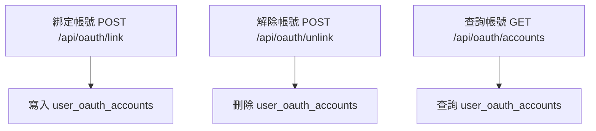

# 後端 API 細化（函數級、mock API、流程圖）

## 用戶相關 API

### 1. 註冊新用戶
- **路徑/方法：** POST /api/users
- **Request Body:**
  ```json
  {
    "username": "string",
    "email": "string",
    "password": "string",
    "industry": "string",
    "business_unit": "string",
    "company_name": "string",
    "ai_classification_yaml": "object",
    "registration_method": "string"
  }
  ```
- **Response:**
  ```json
  { "success": true, "user_id": "u123" }
  ```
- **主要函數：**
  - create_user(data: dict) -> dict
    - 參數：data (dict)
    - 回傳：{ success: bool, user_id: str }
- **mock:**
  ```python
  def create_user(data):
      return {"success": True, "user_id": "u123"}
  ```

### 2. 用戶登入
- **路徑/方法：** POST /api/auth/login
- **Request Body:**
  ```json
  { "username": "string", "password": "string" }
  ```
- **Response:**
  ```json
  { "success": true, "token": "jwt...", "user": { ... } }
  ```
- **主要函數：**
  - login_user(username: str, password: str) -> dict
    - 回傳：{ success: bool, token: str, user: dict }
- **mock:**
  ```python
  def login_user(username, password):
      return {"success": True, "token": "jwt...", "user": {"id": "u123", "email": "..."}}
  ```

### 3. 用戶身份驗證
- **路徑/方法：** POST /api/auth/verify
- **Request Body:**
  ```json
  { "token": "jwt..." }
  ```
- **Response:**
  ```json
  { "valid": true, "user": { ... } }
  ```
- **主要函數：**
  - verify_token(token: str) -> dict
    - 回傳：{ valid: bool, user: dict }
- **mock:**
  ```python
  def verify_token(token):
      return {"valid": True, "user": {"id": "u123", "email": "..."}}
  ```

### 4. 查詢用戶清單/明細
- **路徑/方法：**
  - GET /api/users
  - GET /api/users/{id}
- **Response:**
  ```json
  [
    { "id": "u123", "username": "...", "email": "...", ... }
  ]
  ```
- **主要函數：**
  - get_users() -> list
  - get_user_by_id(user_id: str) -> dict
- **mock:**
  ```python
  def get_users():
      return [{"id": "u123", "username": "test", "email": "..."}]
  def get_user_by_id(user_id):
      return {"id": user_id, "username": "test", "email": "..."}
  ```

### 5. 權限/角色查詢
- **路徑/方法：**
  - GET /api/roles
  - GET /api/permissions
- **Response:**
  ```json
  [ { "id": 1, "name": "admin", "description": "..." } ]
  ```
- **主要函數：**
  - get_roles() -> list
  - get_permissions() -> list
- **mock:**
  ```python
  def get_roles():
      return [{"id": 1, "name": "admin", "description": "管理員"}]
  def get_permissions():
      return [{"id": 1, "name": "view_user", "resource": "user", "action": "view"}]
  ```

### 6. 綁定第三方帳號（OAuth）
- **路徑/方法：** POST /api/oauth/link
- **Request Body:**
  ```json
  {
    "provider": "google",
    "provider_user_id": "1234567890",
    "access_token": "string",
    "refresh_token": "string",
    "token_expiry": "2024-07-01T12:00:00Z"
  }
  ```
- **Response:**
  ```json
  { "success": true }
  ```
- **主要函數：**
  - link_oauth_account(user_id: str, provider: str, provider_user_id: str, access_token: str, refresh_token: str, token_expiry: str) -> dict
- **mock:**
  ```python
  def link_oauth_account(user_id, provider, provider_user_id, access_token, refresh_token, token_expiry):
      return {"success": True}
  ```

### 7. 解除第三方帳號（OAuth）
- **路徑/方法：** POST /api/oauth/unlink
- **Request Body:**
  ```json
  {
    "provider": "google",
    "provider_user_id": "1234567890"
  }
  ```
- **Response:**
  ```json
  { "success": true }
  ```
- **主要函數：**
  - unlink_oauth_account(user_id: str, provider: str, provider_user_id: str) -> dict
- **mock:**
  ```python
  def unlink_oauth_account(user_id, provider, provider_user_id):
      return {"success": True}
  ```

### 8. 查詢所有綁定的第三方帳號
- **路徑/方法：** GET /api/oauth/accounts
- **Response:**
  ```json
  [
    {
      "provider": "google",
      "provider_user_id": "1234567890",
      "status": "active",
      "linked_at": "2024-06-15T12:00:00Z"
    }
  ]
  ```
- **主要函數：**
  - list_oauth_accounts(user_id: str) -> list
- **mock:**
  ```python
  def list_oauth_accounts(user_id):
      return [
          {
              "provider": "google",
              "provider_user_id": "1234567890",
              "status": "active",
              "linked_at": "2024-06-15T12:00:00Z"
          }
      ]
  ```

---

## OAuth 綁定/查詢/解除流程圖（Mermaid）



---

## 商品/庫存相關 API

### 1. 新增商品
- **路徑/方法：** POST /api/products
- **Request Body:**
  ```json
  {
    "name": "string",
    "sku": "string",
    "category": "string",
    "unit": "string",
    "price": 100.0,
    "stock": 0,
    "description": "string"
  }
  ```
- **Response:**
  ```json
  { "success": true, "product_id": "p123" }
  ```
- **主要函數：**
  - create_product(data: dict) -> dict
    - 參數：data (dict)
    - 回傳：{ success: bool, product_id: str }
- **mock:**
  ```python
  def create_product(data):
      return {"success": True, "product_id": "p123"}
  ```

### 2. 查詢商品列表
- **路徑/方法：** GET /api/products
- **Query Params:**
  - category: string (optional)
  - keyword: string (optional)
- **Response:**
  ```json
  [
    {
      "id": "p123",
      "name": "string",
      "sku": "string",
      "category": "string",
      "unit": "string",
      "price": 100.0,
      "stock": 0,
      "description": "string"
    }
  ]
  ```
- **主要函數：**
  - list_products(category: str = None, keyword: str = None) -> list
    - 參數：category (str, optional), keyword (str, optional)
    - 回傳：list[dict]
- **mock:**
  ```python
  def list_products(category=None, keyword=None):
      return [{"id": "p123", "name": "商品A", "sku": "SKU001", "category": "食品", "unit": "包", "price": 100.0, "stock": 10, "description": "測試商品"}]
  ```

### 3. 查詢單一商品
- **路徑/方法：** GET /api/products/{id}
- **Response:**
  ```json
  {
    "id": "p123",
    "name": "string",
    "sku": "string",
    "category": "string",
    "unit": "string",
    "price": 100.0,
    "stock": 0,
    "description": "string"
  }
  ```
- **主要函數：**
  - get_product(product_id: str) -> dict
    - 參數：product_id (str)
    - 回傳：dict
- **mock:**
  ```python
  def get_product(product_id):
      return {"id": product_id, "name": "商品A", "sku": "SKU001", "category": "食品", "unit": "包", "price": 100.0, "stock": 10, "description": "測試商品"}
  ```

### 4. 更新商品
- **路徑/方法：** PUT /api/products/{id}
- **Request Body:**
  ```json
  {
    "name": "string",
    "sku": "string",
    "category": "string",
    "unit": "string",
    "price": 100.0,
    "stock": 0,
    "description": "string"
  }
  ```
- **Response:**
  ```json
  { "success": true }
  ```
- **主要函數：**
  - update_product(product_id: str, data: dict) -> dict
    - 參數：product_id (str), data (dict)
    - 回傳：{ success: bool }
- **mock:**
  ```python
  def update_product(product_id, data):
      return {"success": True}
  ```

### 5. 刪除商品
- **路徑/方法：** DELETE /api/products/{id}
- **Response:**
  ```json
  { "success": true }
  ```
- **主要函數：**
  - delete_product(product_id: str) -> dict
    - 參數：product_id (str)
    - 回傳：{ success: bool }
- **mock:**
  ```python
  def delete_product(product_id):
      return {"success": True}
  ```

### 6. 查詢庫存
- **路徑/方法：** GET /api/inventory
- **Query Params:**
  - product_id: string (optional)
- **Response:**
  ```json
  [
    {
      "product_id": "p123",
      "stock": 10,
      "last_updated": "2024-06-15T12:00:00Z"
    }
  ]
  ```
- **主要函數：**
  - get_inventory(product_id: str = None) -> list
    - 參數：product_id (str, optional)
    - 回傳：list[dict]
- **mock:**
  ```python
  def get_inventory(product_id=None):
      return [{"product_id": "p123", "stock": 10, "last_updated": "2024-06-15T12:00:00Z"}]
  ```

### 7. 更新庫存
- **路徑/方法：** PUT /api/inventory/{product_id}
- **Request Body:**
  ```json
  { "stock": 20 }
  ```
- **Response:**
  ```json
  { "success": true }
  ```
- **主要函數：**
  - update_inventory(product_id: str, stock: int) -> dict
    - 參數：product_id (str), stock (int)
    - 回傳：{ success: bool }
- **mock:**
  ```python
  def update_inventory(product_id, stock):
      return {"success": True}
  ```

---

### 商品/庫存 API 狀態流程圖（Mermaid）

```mermaid
flowchart TD
    A[新增商品 POST /api/products] --> B[查詢商品 GET /api/products]
    B --> C[查詢單一商品 GET /api/products/{id}]
    C --> D[更新商品 PUT /api/products/{id}]
    D --> E[刪除商品 DELETE /api/products/{id}]
    B --> F[查詢庫存 GET /api/inventory]
    F --> G[更新庫存 PUT /api/inventory/{product_id}]
```

---

## 訂單/採購/銷售相關 API

### 1. 新增訂單（銷售/採購）
- **路徑/方法：** POST /api/orders
- **Request Body:**
  ```json
  {
    "order_type": "sales|purchase",
    "customer_id": "string", // 銷售訂單用
    "supplier_id": "string", // 採購訂單用
    "order_date": "2024-06-15",
    "items": [
      {
        "product_id": "string",
        "quantity": 10,
        "unit_price": 100.0
      }
    ],
    "note": "string"
  }
  ```
- **Response:**
  ```json
  { "success": true, "order_id": "o123" }
  ```
- **主要函數：**
  - create_order(data: dict) -> dict
    - 參數：data (dict)
    - 回傳：{ success: bool, order_id: str }
- **mock:**
  ```python
  def create_order(data):
      return {"success": True, "order_id": "o123"}
  ```

### 2. 查詢訂單列表
- **路徑/方法：** GET /api/orders
- **Query Params:**
  - order_type: sales|purchase (optional)
  - customer_id: string (optional)
  - supplier_id: string (optional)
  - date_from: string (optional)
  - date_to: string (optional)
- **Response:**
  ```json
  [
    {
      "id": "o123",
      "order_type": "sales",
      "customer_id": "c001",
      "supplier_id": null,
      "order_date": "2024-06-15",
      "items": [
        { "product_id": "p123", "quantity": 10, "unit_price": 100.0 }
      ],
      "total": 1000.0,
      "status": "pending|confirmed|shipped|completed|cancelled",
      "note": "string"
    }
  ]
  ```
- **主要函數：**
  - list_orders(order_type: str = None, customer_id: str = None, supplier_id: str = None, date_from: str = None, date_to: str = None) -> list
    - 參數：order_type, customer_id, supplier_id, date_from, date_to (str, optional)
    - 回傳：list[dict]
- **mock:**
  ```python
  def list_orders(order_type=None, customer_id=None, supplier_id=None, date_from=None, date_to=None):
      return [{"id": "o123", "order_type": "sales", "customer_id": "c001", "supplier_id": None, "order_date": "2024-06-15", "items": [{"product_id": "p123", "quantity": 10, "unit_price": 100.0}], "total": 1000.0, "status": "pending", "note": "測試訂單"}]
  ```

### 3. 查詢單一訂單
- **路徑/方法：** GET /api/orders/{id}
- **Response:**
  ```json
  {
    "id": "o123",
    "order_type": "sales",
    "customer_id": "c001",
    "supplier_id": null,
    "order_date": "2024-06-15",
    "items": [
      { "product_id": "p123", "quantity": 10, "unit_price": 100.0 }
    ],
    "total": 1000.0,
    "status": "pending|confirmed|shipped|completed|cancelled",
    "note": "string"
  }
  ```
- **主要函數：**
  - get_order(order_id: str) -> dict
    - 參數：order_id (str)
    - 回傳：dict
- **mock:**
  ```python
  def get_order(order_id):
      return {"id": order_id, "order_type": "sales", "customer_id": "c001", "supplier_id": None, "order_date": "2024-06-15", "items": [{"product_id": "p123", "quantity": 10, "unit_price": 100.0}], "total": 1000.0, "status": "pending", "note": "測試訂單"}
  ```

### 4. 更新訂單狀態
- **路徑/方法：** PUT /api/orders/{id}/status
- **Request Body:**
  ```json
  { "status": "confirmed|shipped|completed|cancelled" }
  ```
- **Response:**
  ```json
  { "success": true }
  ```
- **主要函數：**
  - update_order_status(order_id: str, status: str) -> dict
    - 參數：order_id (str), status (str)
    - 回傳：{ success: bool }
- **mock:**
  ```python
  def update_order_status(order_id, status):
      return {"success": True}
  ```

### 5. 刪除訂單
- **路徑/方法：** DELETE /api/orders/{id}
- **Response:**
  ```json
  { "success": true }
  ```
- **主要函數：**
  - delete_order(order_id: str) -> dict
    - 參數：order_id (str)
    - 回傳：{ success: bool }
- **mock:**
  ```python
  def delete_order(order_id):
      return {"success": True}
  ```

---

### 訂單/採購/銷售 API 狀態流程圖（Mermaid）

```mermaid
flowchart TD
    A[新增訂單 POST /api/orders] --> B[查詢訂單 GET /api/orders]
    B --> C[查詢單一訂單 GET /api/orders/{id}]
    C --> D[更新訂單狀態 PUT /api/orders/{id}/status]
    D --> E[刪除訂單 DELETE /api/orders/{id}]
```

---

## 財務/會計相關 API

### 1. 新增會計分錄（憑證）
- **路徑/方法：** POST /api/journal_entries
- **Request Body:**
  ```json
  {
    "date": "2024-06-15",
    "description": "string",
    "lines": [
      { "account_code": "string", "debit": 1000.0, "credit": 0.0, "note": "string" },
      { "account_code": "string", "debit": 0.0, "credit": 1000.0, "note": "string" }
    ],
    "reference": "string"
  }
  ```
- **Response:**
  ```json
  { "success": true, "entry_id": "je123" }
  ```
- **主要函數：**
  - create_journal_entry(data: dict) -> dict
    - 參數：data (dict)
    - 回傳：{ success: bool, entry_id: str }
- **mock:**
  ```python
  def create_journal_entry(data):
      return {"success": True, "entry_id": "je123"}
  ```

### 2. 查詢分錄（憑證）列表
- **路徑/方法：** GET /api/journal_entries
- **Query Params:**
  - date_from: string (optional)
  - date_to: string (optional)
  - account_code: string (optional)
- **Response:**
  ```json
  [
    {
      "id": "je123",
      "date": "2024-06-15",
      "description": "string",
      "lines": [
        { "account_code": "1001", "debit": 1000.0, "credit": 0.0, "note": "" },
        { "account_code": "2001", "debit": 0.0, "credit": 1000.0, "note": "" }
      ],
      "reference": "string"
    }
  ]
  ```
- **主要函數：**
  - list_journal_entries(date_from: str = None, date_to: str = None, account_code: str = None) -> list
    - 參數：date_from, date_to, account_code (str, optional)
    - 回傳：list[dict]
- **mock:**
  ```python
  def list_journal_entries(date_from=None, date_to=None, account_code=None):
      return [{"id": "je123", "date": "2024-06-15", "description": "測試分錄", "lines": [{"account_code": "1001", "debit": 1000.0, "credit": 0.0, "note": ""}, {"account_code": "2001", "debit": 0.0, "credit": 1000.0, "note": ""}], "reference": "INV-001"}]
  ```

### 3. 查詢單一分錄（憑證）
- **路徑/方法：** GET /api/journal_entries/{id}
- **Response:**
  ```json
  {
    "id": "je123",
    "date": "2024-06-15",
    "description": "string",
    "lines": [
      { "account_code": "1001", "debit": 1000.0, "credit": 0.0, "note": "" },
      { "account_code": "2001", "debit": 0.0, "credit": 1000.0, "note": "" }
    ],
    "reference": "string"
  }
  ```
- **主要函數：**
  - get_journal_entry(entry_id: str) -> dict
    - 參數：entry_id (str)
    - 回傳：dict
- **mock:**
  ```python
  def get_journal_entry(entry_id):
      return {"id": entry_id, "date": "2024-06-15", "description": "測試分錄", "lines": [{"account_code": "1001", "debit": 1000.0, "credit": 0.0, "note": ""}, {"account_code": "2001", "debit": 0.0, "credit": 1000.0, "note": ""}], "reference": "INV-001"}
  ```

### 4. 新增收付款紀錄
- **路徑/方法：** POST /api/payments
- **Request Body:**
  ```json
  {
    "date": "2024-06-15",
    "type": "receive|pay",
    "amount": 1000.0,
    "counterparty": "string", // 客戶或供應商
    "method": "cash|bank|credit|other",
    "reference": "string",
    "note": "string"
  }
  ```
- **Response:**
  ```json
  { "success": true, "payment_id": "pm123" }
  ```
- **主要函數：**
  - create_payment(data: dict) -> dict
    - 參數：data (dict)
    - 回傳：{ success: bool, payment_id: str }
- **mock:**
  ```python
  def create_payment(data):
      return {"success": True, "payment_id": "pm123"}
  ```

### 5. 查詢收付款紀錄
- **路徑/方法：** GET /api/payments
- **Query Params:**
  - type: receive|pay (optional)
  - counterparty: string (optional)
  - date_from: string (optional)
  - date_to: string (optional)
- **Response:**
  ```json
  [
    {
      "id": "pm123",
      "date": "2024-06-15",
      "type": "receive",
      "amount": 1000.0,
      "counterparty": "客戶A",
      "method": "bank",
      "reference": "INV-001",
      "note": "string"
    }
  ]
  ```
- **主要函數：**
  - list_payments(type: str = None, counterparty: str = None, date_from: str = None, date_to: str = None) -> list
    - 參數：type, counterparty, date_from, date_to (str, optional)
    - 回傳：list[dict]
- **mock:**
  ```python
  def list_payments(type=None, counterparty=None, date_from=None, date_to=None):
      return [{"id": "pm123", "date": "2024-06-15", "type": "receive", "amount": 1000.0, "counterparty": "客戶A", "method": "bank", "reference": "INV-001", "note": ""}]
  ```

### 6. 查詢單一收付款紀錄
- **路徑/方法：** GET /api/payments/{id}
- **Response:**
  ```json
  {
    "id": "pm123",
    "date": "2024-06-15",
    "type": "receive",
    "amount": 1000.0,
    "counterparty": "客戶A",
    "method": "bank",
    "reference": "INV-001",
    "note": "string"
  }
  ```
- **主要函數：**
  - get_payment(payment_id: str) -> dict
    - 參數：payment_id (str)
    - 回傳：dict
- **mock:**
  ```python
  def get_payment(payment_id):
      return {"id": payment_id, "date": "2024-06-15", "type": "receive", "amount": 1000.0, "counterparty": "客戶A", "method": "bank", "reference": "INV-001", "note": ""}
  ```

---

### 財務/會計 API 狀態流程圖（Mermaid）

```mermaid
flowchart TD
    A[新增分錄 POST /api/journal_entries] --> B[查詢分錄 GET /api/journal_entries]
    B --> C[查詢單一分錄 GET /api/journal_entries/{id}]
    D[新增收付款 POST /api/payments] --> E[查詢收付款 GET /api/payments]
    E --> F[查詢單一收付款 GET /api/payments/{id}]
```

---

## HR/人事相關 API

### 1. 新增員工
- **路徑/方法：** POST /api/employees
- **Request Body:**
  ```json
  {
    "name": "string",
    "employee_no": "string",
    "department": "string",
    "position": "string",
    "email": "string",
    "phone": "string",
    "hire_date": "2024-06-15",
    "status": "active|inactive|resigned",
    "note": "string"
  }
  ```
- **Response:**
  ```json
  { "success": true, "employee_id": "e123" }
  ```
- **主要函數：**
  - create_employee(data: dict) -> dict
    - 參數：data (dict)
    - 回傳：{ success: bool, employee_id: str }
- **mock:**
  ```python
  def create_employee(data):
      return {"success": True, "employee_id": "e123"}
  ```

### 2. 查詢員工列表
- **路徑/方法：** GET /api/employees
- **Query Params:**
  - department: string (optional)
  - status: string (optional)
- **Response:**
  ```json
  [
    {
      "id": "e123",
      "name": "string",
      "employee_no": "string",
      "department": "string",
      "position": "string",
      "email": "string",
      "phone": "string",
      "hire_date": "2024-06-15",
      "status": "active",
      "note": "string"
    }
  ]
  ```
- **主要函數：**
  - list_employees(department: str = None, status: str = None) -> list
    - 參數：department, status (str, optional)
    - 回傳：list[dict]
- **mock:**
  ```python
  def list_employees(department=None, status=None):
      return [{"id": "e123", "name": "王小明", "employee_no": "EMP001", "department": "研發部", "position": "工程師", "email": "test@example.com", "phone": "0912345678", "hire_date": "2024-06-15", "status": "active", "note": ""}]
  ```

### 3. 查詢單一員工
- **路徑/方法：** GET /api/employees/{id}
- **Response:**
  ```json
  {
    "id": "e123",
    "name": "string",
    "employee_no": "string",
    "department": "string",
    "position": "string",
    "email": "string",
    "phone": "string",
    "hire_date": "2024-06-15",
    "status": "active",
    "note": "string"
  }
  ```
- **主要函數：**
  - get_employee(employee_id: str) -> dict
    - 參數：employee_id (str)
    - 回傳：dict
- **mock:**
  ```python
  def get_employee(employee_id):
      return {"id": employee_id, "name": "王小明", "employee_no": "EMP001", "department": "研發部", "position": "工程師", "email": "test@example.com", "phone": "0912345678", "hire_date": "2024-06-15", "status": "active", "note": ""}
  ```

### 4. 更新員工資料
- **路徑/方法：** PUT /api/employees/{id}
- **Request Body:**
  ```json
  {
    "name": "string",
    "employee_no": "string",
    "department": "string",
    "position": "string",
    "email": "string",
    "phone": "string",
    "hire_date": "2024-06-15",
    "status": "active|inactive|resigned",
    "note": "string"
  }
  ```
- **Response:**
  ```json
  { "success": true }
  ```
- **主要函數：**
  - update_employee(employee_id: str, data: dict) -> dict
    - 參數：employee_id (str), data (dict)
    - 回傳：{ success: bool }
- **mock:**
  ```python
  def update_employee(employee_id, data):
      return {"success": True}
  ```

### 5. 刪除員工
- **路徑/方法：** DELETE /api/employees/{id}
- **Response:**
  ```json
  { "success": true }
  ```
- **主要函數：**
  - delete_employee(employee_id: str) -> dict
    - 參數：employee_id (str)
    - 回傳：{ success: bool }
- **mock:**
  ```python
  def delete_employee(employee_id):
      return {"success": True}
  ```

### 6. 新增出勤紀錄
- **路徑/方法：** POST /api/attendance
- **Request Body:**
  ```json
  {
    "employee_id": "string",
    "date": "2024-06-15",
    "check_in": "09:00",
    "check_out": "18:00",
    "note": "string"
  }
  ```
- **Response:**
  ```json
  { "success": true, "attendance_id": "a123" }
  ```
- **主要函數：**
  - create_attendance(data: dict) -> dict
    - 參數：data (dict)
    - 回傳：{ success: bool, attendance_id: str }
- **mock:**
  ```python
  def create_attendance(data):
      return {"success": True, "attendance_id": "a123"}
  ```

### 7. 查詢出勤紀錄
- **路徑/方法：** GET /api/attendance
- **Query Params:**
  - employee_id: string (optional)
  - date_from: string (optional)
  - date_to: string (optional)
- **Response:**
  ```json
  [
    {
      "id": "a123",
      "employee_id": "e123",
      "date": "2024-06-15",
      "check_in": "09:00",
      "check_out": "18:00",
      "note": "string"
    }
  ]
  ```
- **主要函數：**
  - list_attendance(employee_id: str = None, date_from: str = None, date_to: str = None) -> list
    - 參數：employee_id, date_from, date_to (str, optional)
    - 回傳：list[dict]
- **mock:**
  ```python
  def list_attendance(employee_id=None, date_from=None, date_to=None):
      return [{"id": "a123", "employee_id": "e123", "date": "2024-06-15", "check_in": "09:00", "check_out": "18:00", "note": ""}]
  ```

### 8. 查詢單一出勤紀錄
- **路徑/方法：** GET /api/attendance/{id}
- **Response:**
  ```json
  {
    "id": "a123",
    "employee_id": "e123",
    "date": "2024-06-15",
    "check_in": "09:00",
    "check_out": "18:00",
    "note": "string"
  }
  ```
- **主要函數：**
  - get_attendance(attendance_id: str) -> dict
    - 參數：attendance_id (str)
    - 回傳：dict
- **mock:**
  ```python
  def get_attendance(attendance_id):
      return {"id": attendance_id, "employee_id": "e123", "date": "2024-06-15", "check_in": "09:00", "check_out": "18:00", "note": ""}
  ```

---

### HR/人事 API 狀態流程圖（Mermaid）

```mermaid
flowchart TD
    A[新增員工 POST /api/employees] --> B[查詢員工 GET /api/employees]
    B --> C[查詢單一員工 GET /api/employees/{id}]
    C --> D[更新員工 PUT /api/employees/{id}]
    D --> E[刪除員工 DELETE /api/employees/{id}]
    F[新增出勤 POST /api/attendance] --> G[查詢出勤 GET /api/attendance]
    G --> H[查詢單一出勤 GET /api/attendance/{id}]
``` 

---

## HR/人事進階 API

### 1. 薪資發放
#### 1.1 新增薪資單
- **路徑/方法：** POST /api/payrolls
- **Request Body:**
  ```json
  {
    "employee_id": "string",
    "period": "2024-06",
    "base_salary": 40000.0,
    "bonus": 5000.0,
    "deduction": 2000.0,
    "net_salary": 43000.0,
    "note": "string"
  }
  ```
- **Response:**
  ```json
  { "success": true, "payroll_id": "pr123" }
  ```
- **主要函數：**
  - create_payroll(data: dict) -> dict
- **mock:**
  ```python
  def create_payroll(data):
      return {"success": True, "payroll_id": "pr123"}
  ```

#### 1.2 查詢薪資單
- **路徑/方法：** GET /api/payrolls
- **Query Params:**
  - employee_id: string (optional)
  - period: string (optional)
- **Response:**
  ```json
  [
    {
      "id": "pr123",
      "employee_id": "e123",
      "period": "2024-06",
      "base_salary": 40000.0,
      "bonus": 5000.0,
      "deduction": 2000.0,
      "net_salary": 43000.0,
      "note": "string"
    }
  ]
  ```
- **主要函數：**
  - list_payrolls(employee_id: str = None, period: str = None) -> list
- **mock:**
  ```python
  def list_payrolls(employee_id=None, period=None):
      return [{"id": "pr123", "employee_id": "e123", "period": "2024-06", "base_salary": 40000.0, "bonus": 5000.0, "deduction": 2000.0, "net_salary": 43000.0, "note": ""}]
  ```

#### 1.3 發放薪資
- **路徑/方法：** POST /api/payrolls/{id}/issue
- **Response:**
  ```json
  { "success": true }
  ```
- **主要函數：**
  - issue_payroll(payroll_id: str) -> dict
- **mock:**
  ```python
  def issue_payroll(payroll_id):
      return {"success": True}
  ```

### 2. 假勤申請/審核
#### 2.1 新增請假單
- **路徑/方法：** POST /api/leave_requests
- **Request Body:**
  ```json
  {
    "employee_id": "string",
    "leave_type": "annual|sick|personal|other",
    "date_from": "2024-06-20",
    "date_to": "2024-06-22",
    "days": 3,
    "reason": "string"
  }
  ```
- **Response:**
  ```json
  { "success": true, "leave_id": "lv123" }
  ```
- **主要函數：**
  - create_leave_request(data: dict) -> dict
- **mock:**
  ```python
  def create_leave_request(data):
      return {"success": True, "leave_id": "lv123"}
  ```

#### 2.2 查詢請假單
- **路徑/方法：** GET /api/leave_requests
- **Query Params:**
  - employee_id: string (optional)
  - status: string (optional)
- **Response:**
  ```json
  [
    {
      "id": "lv123",
      "employee_id": "e123",
      "leave_type": "annual",
      "date_from": "2024-06-20",
      "date_to": "2024-06-22",
      "days": 3,
      "reason": "string",
      "status": "pending|approved|rejected",
      "approver": "string"
    }
  ]
  ```
- **主要函數：**
  - list_leave_requests(employee_id: str = None, status: str = None) -> list
- **mock:**
  ```python
  def list_leave_requests(employee_id=None, status=None):
      return [{"id": "lv123", "employee_id": "e123", "leave_type": "annual", "date_from": "2024-06-20", "date_to": "2024-06-22", "days": 3, "reason": "", "status": "pending", "approver": ""}]
  ```

#### 2.3 假勤審核
- **路徑/方法：** PUT /api/leave_requests/{id}/review
- **Request Body:**
  ```json
  { "status": "approved|rejected", "approver": "string", "review_note": "string" }
  ```
- **Response:**
  ```json
  { "success": true }
  ```
- **主要函數：**
  - review_leave_request(leave_id: str, status: str, approver: str, review_note: str) -> dict
- **mock:**
  ```python
  def review_leave_request(leave_id, status, approver, review_note):
      return {"success": True}
  ```

### 3. 部門/職位 CRUD
#### 3.1 新增部門
- **路徑/方法：** POST /api/departments
- **Request Body:**
  ```json
  { "name": "string", "manager": "string", "note": "string" }
  ```
- **Response:**
  ```json
  { "success": true, "department_id": "d123" }
  ```
- **主要函數：**
  - create_department(data: dict) -> dict
- **mock:**
  ```python
  def create_department(data):
      return {"success": True, "department_id": "d123"}
  ```

#### 3.2 查詢部門
- **路徑/方法：** GET /api/departments
- **Response:**
  ```json
  [
    { "id": "d123", "name": "研發部", "manager": "王主管", "note": "" }
  ]
  ```
- **主要函數：**
  - list_departments() -> list
- **mock:**
  ```python
  def list_departments():
      return [{"id": "d123", "name": "研發部", "manager": "王主管", "note": ""}]
  ```

#### 3.3 新增職位
- **路徑/方法：** POST /api/positions
- **Request Body:**
  ```json
  { "name": "string", "department_id": "string", "note": "string" }
  ```
- **Response:**
  ```json
  { "success": true, "position_id": "p123" }
  ```
- **主要函數：**
  - create_position(data: dict) -> dict
- **mock:**
  ```python
  def create_position(data):
      return {"success": True, "position_id": "p123"}
  ```

#### 3.4 查詢職位
- **路徑/方法：** GET /api/positions
- **Response:**
  ```json
  [
    { "id": "p123", "name": "工程師", "department_id": "d123", "note": "" }
  ]
  ```
- **主要函數：**
  - list_positions() -> list
- **mock:**
  ```python
  def list_positions():
      return [{"id": "p123", "name": "工程師", "department_id": "d123", "note": ""}]
  ```

### 4. 員工異動
- **路徑/方法：** POST /api/employee_changes
- **Request Body:**
  ```json
  {
    "employee_id": "string",
    "change_type": "transfer|promotion|demotion|resign|other",
    "date": "2024-06-15",
    "from_department": "string",
    "to_department": "string",
    "from_position": "string",
    "to_position": "string",
    "note": "string"
  }
  ```
- **Response:**
  ```json
  { "success": true, "change_id": "chg123" }
  ```
- **主要函數：**
  - create_employee_change(data: dict) -> dict
- **mock:**
  ```python
  def create_employee_change(data):
      return {"success": True, "change_id": "chg123"}
  ```

### 5. 批次匯入
- **路徑/方法：** POST /api/employees/import
- **Request Body:**
  ```json
  { "file": "base64-encoded-csv-or-xlsx" }
  ```
- **Response:**
  ```json
  { "success": true, "imported": 10, "failed": 2, "errors": ["row 3: email 重複"] }
  ```
- **主要函數：**
  - import_employees(file: str) -> dict
- **mock:**
  ```python
  def import_employees(file):
      return {"success": True, "imported": 10, "failed": 2, "errors": ["row 3: email 重複"]}
  ```

### 6. 考核
- **路徑/方法：** POST /api/performance_reviews
- **Request Body:**
  ```json
  {
    "employee_id": "string",
    "review_date": "2024-06-15",
    "score": 85,
    "reviewer": "string",
    "comment": "string"
  }
  ```
- **Response:**
  ```json
  { "success": true, "review_id": "rv123" }
  ```
- **主要函數：**
  - create_performance_review(data: dict) -> dict
- **mock:**
  ```python
  def create_performance_review(data):
      return {"success": True, "review_id": "rv123"}
  ```

---

### HR/人事進階 API 狀態流程圖（Mermaid）

```mermaid
flowchart TD
    A[新增薪資單 POST /api/payrolls] --> B[查詢薪資單 GET /api/payrolls]
    B --> C[發放薪資 POST /api/payrolls/{id}/issue]
    D[新增請假單 POST /api/leave_requests] --> E[查詢請假單 GET /api/leave_requests]
    E --> F[假勤審核 PUT /api/leave_requests/{id}/review]
    G[新增部門 POST /api/departments] --> H[查詢部門 GET /api/departments]
    I[新增職位 POST /api/positions] --> J[查詢職位 GET /api/positions]
    K[員工異動 POST /api/employee_changes]
    L[批次匯入 POST /api/employees/import]
    M[考核 POST /api/performance_reviews]
``` 

---

## BI/報表 API

### 1. 產生報表
- **路徑/方法：** POST /api/reports/generate
- **Request Body:**
  ```json
  {
    "report_type": "sales|inventory|finance|hr|custom",
    "date_from": "2024-06-01",
    "date_to": "2024-06-30",
    "filters": { "department": "研發部" }
  }
  ```
- **Response:**
  ```json
  { "success": true, "report_id": "r123", "download_url": "/api/reports/r123/download" }
  ```
- **主要函數：**
  - generate_report(data: dict) -> dict
- **mock:**
  ```python
  def generate_report(data):
      return {"success": True, "report_id": "r123", "download_url": "/api/reports/r123/download"}
  ```

### 2. 查詢報表列表
- **路徑/方法：** GET /api/reports
- **Query Params:**
  - report_type: string (optional)
  - date_from: string (optional)
  - date_to: string (optional)
- **Response:**
  ```json
  [
    { "id": "r123", "report_type": "sales", "created_at": "2024-06-30T12:00:00Z", "status": "ready|processing|failed", "download_url": "/api/reports/r123/download" }
  ]
  ```
- **主要函數：**
  - list_reports(report_type: str = None, date_from: str = None, date_to: str = None) -> list
- **mock:**
  ```python
  def list_reports(report_type=None, date_from=None, date_to=None):
      return [{"id": "r123", "report_type": "sales", "created_at": "2024-06-30T12:00:00Z", "status": "ready", "download_url": "/api/reports/r123/download"}]
  ```

### 3. 下載報表
- **路徑/方法：** GET /api/reports/{id}/download
- **Response:**
  - 檔案下載（如 PDF、Excel、CSV）
- **主要函數：**
  - download_report(report_id: str) -> bytes
- **mock:**
  ```python
  def download_report(report_id):
      return b"PDF/Excel/CSV file bytes"
  ```

---

## IoT/設備 API

### 1. 新增設備
- **路徑/方法：** POST /api/devices
- **Request Body:**
  ```json
  {
    "name": "string",
    "device_type": "sensor|controller|gateway|other",
    "serial_no": "string",
    "location": "string",
    "status": "active|inactive|fault",
    "note": "string"
  }
  ```
- **Response:**
  ```json
  { "success": true, "device_id": "dev123" }
  ```
- **主要函數：**
  - create_device(data: dict) -> dict
- **mock:**
  ```python
  def create_device(data):
      return {"success": True, "device_id": "dev123"}
  ```

### 2. 查詢設備列表
- **路徑/方法：** GET /api/devices
- **Query Params:**
  - device_type: string (optional)
  - status: string (optional)
- **Response:**
  ```json
  [
    { "id": "dev123", "name": "溫度感測器", "device_type": "sensor", "serial_no": "SN001", "location": "倉庫A", "status": "active", "note": "" }
  ]
  ```
- **主要函數：**
  - list_devices(device_type: str = None, status: str = None) -> list
- **mock:**
  ```python
  def list_devices(device_type=None, status=None):
      return [{"id": "dev123", "name": "溫度感測器", "device_type": "sensor", "serial_no": "SN001", "location": "倉庫A", "status": "active", "note": ""}]
  ```

### 3. 查詢單一設備
- **路徑/方法：** GET /api/devices/{id}
- **Response:**
  ```json
  {
    "id": "dev123",
    "name": "string",
    "device_type": "sensor",
    "serial_no": "string",
    "location": "string",
    "status": "active",
    "note": "string"
  }
  ```
- **主要函數：**
  - get_device(device_id: str) -> dict
- **mock:**
  ```python
  def get_device(device_id):
      return {"id": device_id, "name": "溫度感測器", "device_type": "sensor", "serial_no": "SN001", "location": "倉庫A", "status": "active", "note": ""}
  ```

### 4. 上傳設備數據
- **路徑/方法：** POST /api/devices/{id}/data
- **Request Body:**
  ```json
  {
    "timestamp": "2024-06-15T12:00:00Z",
    "data": { "temperature": 25.3, "humidity": 60 }
  }
  ```
- **Response:**
  ```json
  { "success": true }
  ```
- **主要函數：**
  - upload_device_data(device_id: str, data: dict) -> dict
- **mock:**
  ```python
  def upload_device_data(device_id, data):
      return {"success": True}
  ```

### 5. 查詢設備數據
- **路徑/方法：** GET /api/devices/{id}/data
- **Query Params:**
  - date_from: string (optional)
  - date_to: string (optional)
- **Response:**
  ```json
  [
    { "timestamp": "2024-06-15T12:00:00Z", "data": { "temperature": 25.3, "humidity": 60 } }
  ]
  ```
- **主要函數：**
  - list_device_data(device_id: str, date_from: str = None, date_to: str = None) -> list
- **mock:**
  ```python
  def list_device_data(device_id, date_from=None, date_to=None):
      return [{"timestamp": "2024-06-15T12:00:00Z", "data": {"temperature": 25.3, "humidity": 60}}]
  ```

---

### BI/IoT API 狀態流程圖（Mermaid）

```mermaid
flowchart TD
    A[產生報表 POST /api/reports/generate] --> B[查詢報表 GET /api/reports]
    B --> C[下載報表 GET /api/reports/{id}/download]
    D[新增設備 POST /api/devices] --> E[查詢設備 GET /api/devices]
    E --> F[查詢單一設備 GET /api/devices/{id}]
    F --> G[上傳設備數據 POST /api/devices/{id}/data]
    F --> H[查詢設備數據 GET /api/devices/{id}/data]
``` 

---

## BI/IoT 進階 API

### 1. 自訂報表設計
- **路徑/方法：** POST /api/report_templates
- **Request Body:**
  ```json
  {
    "name": "string",
    "description": "string",
    "fields": ["field1", "field2"],
    "filters": ["date_from", "date_to", "department"],
    "layout": "json-schema-or-html"
  }
  ```
- **Response:**
  ```json
  { "success": true, "template_id": "tpl123" }
  ```
- **主要函數：**
  - create_report_template(data: dict) -> dict
- **mock:**
  ```python
  def create_report_template(data):
      return {"success": True, "template_id": "tpl123"}
  ```

### 2. 報表權限管理
- **路徑/方法：** POST /api/report_permissions
- **Request Body:**
  ```json
  {
    "report_id": "string",
    "user_id": "string",
    "permission": "view|download|manage"
  }
  ```
- **Response:**
  ```json
  { "success": true }
  ```
- **主要函數：**
  - set_report_permission(report_id: str, user_id: str, permission: str) -> dict
- **mock:**
  ```python
  def set_report_permission(report_id, user_id, permission):
      return {"success": True}
  ```

### 3. 設備類型 CRUD
#### 3.1 新增設備類型
- **路徑/方法：** POST /api/device_types
- **Request Body:**
  ```json
  { "name": "string", "description": "string" }
  ```
- **Response:**
  ```json
  { "success": true, "type_id": "dt123" }
  ```
- **主要函數：**
  - create_device_type(data: dict) -> dict
- **mock:**
  ```python
  def create_device_type(data):
      return {"success": True, "type_id": "dt123"}
  ```

#### 3.2 查詢設備類型
- **路徑/方法：** GET /api/device_types
- **Response:**
  ```json
  [ { "id": "dt123", "name": "溫度感測器", "description": "測量溫度" } ]
  ```
- **主要函數：**
  - list_device_types() -> list
- **mock:**
  ```python
  def list_device_types():
      return [{"id": "dt123", "name": "溫度感測器", "description": "測量溫度"}]
  ```

### 4. 設備異常警報
- **路徑/方法：** POST /api/device_alerts
- **Request Body:**
  ```json
  {
    "device_id": "string",
    "alert_type": "offline|overheat|low_battery|custom",
    "message": "string",
    "timestamp": "2024-06-15T12:00:00Z"
  }
  ```
- **Response:**
  ```json
  { "success": true, "alert_id": "al123" }
  ```
- **主要函數：**
  - create_device_alert(data: dict) -> dict
- **mock:**
  ```python
  def create_device_alert(data):
      return {"success": True, "alert_id": "al123"}
  ```

### 5. 查詢設備警報
- **路徑/方法：** GET /api/device_alerts
- **Query Params:**
  - device_id: string (optional)
  - alert_type: string (optional)
- **Response:**
  ```json
  [ { "id": "al123", "device_id": "dev123", "alert_type": "offline", "message": "設備離線", "timestamp": "2024-06-15T12:00:00Z" } ]
  ```
- **主要函數：**
  - list_device_alerts(device_id: str = None, alert_type: str = None) -> list
- **mock:**
  ```python
  def list_device_alerts(device_id=None, alert_type=None):
      return [{"id": "al123", "device_id": "dev123", "alert_type": "offline", "message": "設備離線", "timestamp": "2024-06-15T12:00:00Z"}]
  ```

### 6. 數據分析 API
- **路徑/方法：** POST /api/device_data/analyze
- **Request Body:**
  ```json
  {
    "device_id": "string",
    "date_from": "2024-06-01",
    "date_to": "2024-06-15",
    "analysis_type": "trend|anomaly|summary|custom"
  }
  ```
- **Response:**
  ```json
  {
    "success": true,
    "result": {
      "trend": [ { "date": "2024-06-01", "value": 25.1 }, { "date": "2024-06-02", "value": 25.3 } ],
      "anomaly": [ { "date": "2024-06-10", "value": 30.0, "type": "overheat" } ],
      "summary": { "avg": 25.2, "max": 30.0, "min": 20.0 }
    }
  }
  ```
- **主要函數：**
  - analyze_device_data(device_id: str, date_from: str, date_to: str, analysis_type: str) -> dict
- **mock:**
  ```python
  def analyze_device_data(device_id, date_from, date_to, analysis_type):
      return {"success": True, "result": {"trend": [{"date": "2024-06-01", "value": 25.1}], "anomaly": [], "summary": {"avg": 25.2, "max": 30.0, "min": 20.0}}}
  ```

---

### BI/IoT 進階 API 狀態流程圖（Mermaid）

```mermaid
flowchart TD
    A[自訂報表設計 POST /api/report_templates] --> B[產生報表 POST /api/reports/generate]
    B --> C[查詢報表 GET /api/reports]
    C --> D[下載報表 GET /api/reports/{id}/download]
    C --> E[報表權限管理 POST /api/report_permissions]
    F[新增設備類型 POST /api/device_types] --> G[查詢設備類型 GET /api/device_types]
    H[新增設備 POST /api/devices] --> I[查詢設備 GET /api/devices]
    I --> J[查詢單一設備 GET /api/devices/{id}]
    J --> K1[上傳設備數據 POST /api/devices/{id}/data]
    J --> K2[查詢設備數據 GET /api/devices/{id}/data]
    J --> L[設備異常警報 POST /api/device_alerts]
    L --> M[查詢設備警報 GET /api/device_alerts]
    J --> N[數據分析 POST /api/device_data/analyze]
``` 

---

## API 測試規劃

### 測試目錄與命名規範
- 測試目錄：`tests/api/`
- 檔案命名：`test_<api_name>.py`（如 test_users.py、test_products.py）
- 每個 API 類型一個測試檔案，測試函數以 `test_` 開頭

---

### 1. 用戶 API 測試案例
- 檔案：`tests/api/test_users.py`
- 典型案例：
  - test_register_user_success
    - mock 輸入：有效 username/email/password
    - 預期：201, 回傳 user_id
  - test_register_user_duplicate_email
    - mock 輸入：已存在 email
    - 預期：400, 錯誤訊息
  - test_login_success
    - mock 輸入：正確帳密
    - 預期：200, JWT token
  - test_login_wrong_password
    - mock 輸入：錯誤密碼
    - 預期：401, 錯誤訊息
  - test_get_user_not_found
    - mock 輸入：不存在 id
    - 預期：404

---

### 2. 商品/庫存 API 測試案例
- 檔案：`tests/api/test_products.py`
- 典型案例：
  - test_create_product_success
    - mock 輸入：完整商品資料
    - 預期：201, product_id
  - test_create_product_missing_field
    - mock 輸入：缺 name
    - 預期：400
  - test_list_products_filter
    - mock 輸入：category=食品
    - 預期：200, 篩選結果
  - test_update_product_not_found
    - mock 輸入：不存在 id
    - 預期：404

---

### 3. 訂單/採購/銷售 API 測試案例
- 檔案：`tests/api/test_orders.py`
- 典型案例：
  - test_create_order_sales_success
    - mock 輸入：有效銷售訂單
    - 預期：201, order_id
  - test_create_order_invalid_item
    - mock 輸入：不存在商品 id
    - 預期：400
  - test_update_order_status_flow
    - mock 輸入：pending→confirmed→shipped
    - 預期：狀態正確變更
  - test_delete_order_not_found
    - mock 輸入：不存在 id
    - 預期：404

---

### 4. HR/人事 API 測試案例
- 檔案：`tests/api/test_employees.py`
- 典型案例：
  - test_create_employee_success
    - mock 輸入：完整員工資料
    - 預期：201, employee_id
  - test_create_employee_duplicate_no
    - mock 輸入：重複 employee_no
    - 預期：400
  - test_list_attendance_by_date
    - mock 輸入：date_from/date_to
    - 預期：200, 篩選結果
  - test_import_employees_batch
    - mock 輸入：批次匯入檔
    - 預期：200, 匯入數量/錯誤

---

### 5. BI/報表 API 測試案例
- 檔案：`tests/api/test_reports.py`
- 典型案例：
  - test_generate_report_success
    - mock 輸入：有效報表參數
    - 預期：201, report_id
  - test_generate_report_invalid_type
    - mock 輸入：不支援 report_type
    - 預期：400
  - test_download_report_not_ready
    - mock 輸入：status=processing
    - 預期：409, 錯誤訊息

---

### 6. IoT/設備 API 測試案例
- 檔案：`tests/api/test_devices.py`
- 典型案例：
  - test_create_device_success
    - mock 輸入：完整設備資料
    - 預期：201, device_id
  - test_upload_device_data_success
    - mock 輸入：正確數據格式
    - 預期：200
  - test_device_alert_trigger
    - mock 輸入：異常數據
    - 預期：自動產生警報
  - test_analyze_device_data_trend
    - mock 輸入：trend analysis
    - 預期：200, trend 結果

---

### 覆蓋邊界情境
- 欄位長度/格式錯誤
- 權限不足/未登入
- 非法請求方法
- 大量資料/高併發
- 外部依賴失敗（如第三方 API）

---

> 測試案例可依據此規劃直接撰寫 pytest/Jest/Vitest 測試程式，並可擴充更多異常與安全性測試。 