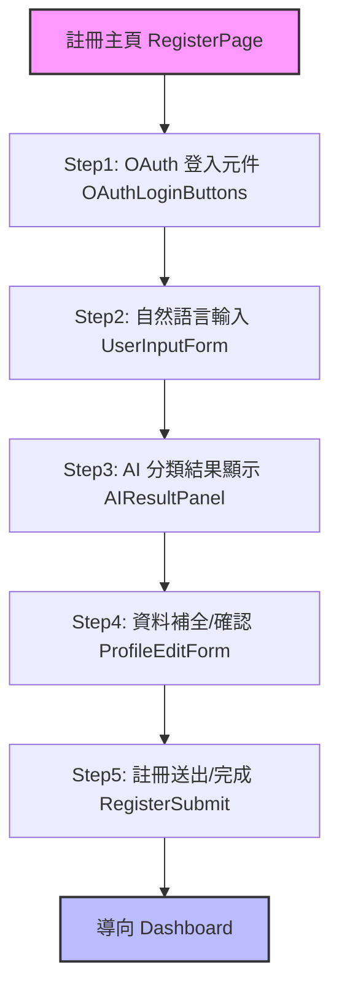

# 前端架構細化（函數級、mock API、UI wireframe）

## 主要元件
- RegisterPage
- OAuthLoginButtons
- UserInputForm
- AIResultPanel
- ProfileEditForm
- RegisterSubmit
- Dashboard

---

## RegisterPage
- **Props:** 無
- **State:**
  - step: number
  - oauthStatus: 'idle'|'loading'|'success'|'error'
  - userInput: string
  - aiResult: object | null
  - profileData: object
  - error: string | null
- **主要函數：**
  - handleStepChange(nextStep: number): void
  - handleOAuthLogin(provider: 'google'|'line'): Promise<OAuthUserInfo>
  - handleUserInput(input: string): void
  - handleAISubmit(input: string): Promise<AIResult>
  - handleProfileEdit(profile: object): void
  - handleRegister(profile: object): Promise<RegisterResult>
- **UI wireframe:**
  - 參見下方 Mermaid 流程圖

## OAuthLoginButtons
- **Props:** onLogin(provider: string): void
- **State:** loading: boolean
- **mock API:**
  ```js
  // POST /api/register/oauth
  { provider: "google", token: "xxx" }
  // 回傳
  { id: "u123", email: "test@gmail.com", name: "王小明", avatar: "https://...", token: "jwt..." }
  ```

## UserInputForm
- **Props:** onSubmit(input: string): void
- **State:** input: string
- **mock API:**
  ```js
  // POST /api/register/ai
  { input: "我經營一家雞肉批發公司，主要服務餐廳與市場" }
  // 回傳
  { yaml: "industry: 雞肉批發\nbusiness_unit: 餐飲供應\ncompany_name: ...", parsed: { industry: "雞肉批發", business_unit: "餐飲供應", company_name: "..." } }
  ```

## AIResultPanel
- **Props:** yaml: string, parsed: object, onEdit: (profile: object) => void
- **State:** editing: boolean
- **UI:** YAML 區塊顯示 + 編輯按鈕

## ProfileEditForm
- **Props:** profile: object, onSubmit: (profile: object) => void
- **State:** profile: object
- **UI:** 表單欄位自動對應資料庫（產業、單位、公司名、email...）

## RegisterSubmit
- **Props:** profile: object, onSubmit: (profile: object) => void
- **State:** submitting: boolean
- **mock API:**
  ```js
  // POST /api/users
  { username: "test", email: "test@gmail.com", ... }
  // 回傳
  { success: true, user_id: "u123" }
  ```

## Dashboard
- **Props:** user: object
- **State:** loading: boolean

---

## UI wireframe (Mermaid)

